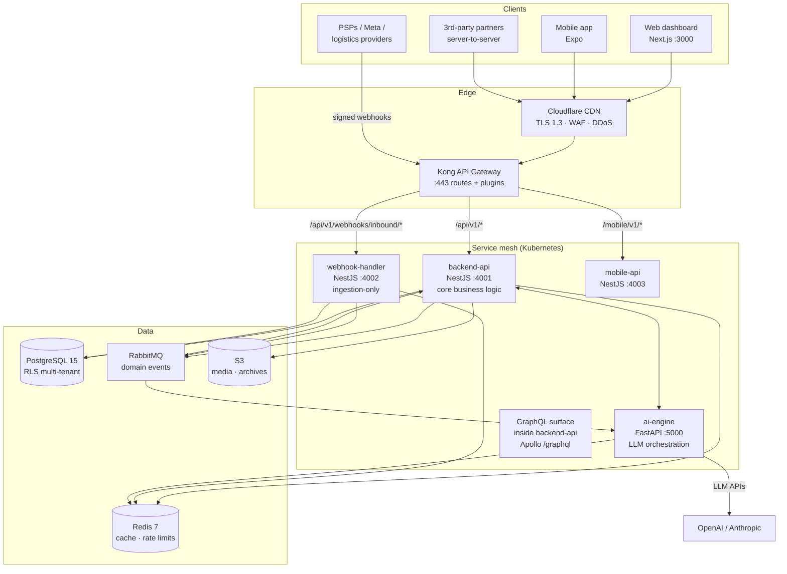

# API Architecture

> How a request travels from the internet to PostgreSQL and back — gateway topology,
> service communication patterns, authentication flows, and the reasoning behind each choice.

---

## 1. Topology at a glance



**Design rule:** the public internet only ever talks to Kong. Kong terminates TLS,
applies edge policies (WAF, IP reputation, global rate ceilings, request size caps),
and forwards to internal services over the cluster network. Internal services are
**never** exposed via LoadBalancer/Ingress except through the gateway route table.

In dev, backend-api itself listens on `:4000` and serves `/api/v1` directly (the
gateway runs only in staging/prod); all application-level policies below are enforced
in-process so behavior is identical behind Kong or not.

---

## 2. Gateway design (Kong)

### 2.1 Why Kong (decision summary)

| Requirement | Kong answer |
|---|---|
| Multi-tenant rate limiting per API key/JWT | `rate-limiting-advanced` backed by Redis cluster |
| Per-route plugin chains without redeploying services | declarative DB-less config in git (`infra/kong/kong.yml`) |
| mTLS for partner tier | `mtls-auth` on `/partners/*` route |
| Legacy alias rewrites (v0 paths → v1) | `request-transformer` |
| Observability | Prometheus plugin + OpenTelemetry header propagation |
| Canary / blue-green per service | upstream target weights |

AWS API Gateway is an acceptable substitute for AWS-only deployments; every policy in
this document maps 1:1 (usage plans ≈ consumer tiers, Lambda authorizer ≈ JWT plugin).
We standardize on Kong to stay cloud-portable.

### 2.2 Declarative config (excerpt — `infra/kong/kong.yml`)

```yaml
_format_version: "3.0"
services:
  - name: backend-api
    url: http://backend-api.wco-internal:4001
    routes:
      - name: api-v1
        paths: ["/api/v1"]
        strip_path: false
        plugins:
          - name: cors
            config:
              origins: ["https://app.wco.africa", "https://admin.wco.africa"]
              methods: [GET, POST, PUT, PATCH, DELETE, OPTIONS]
              headers: [Content-Type, Authorization, X-Request-ID, X-Idempotency-Key, X-Store-Id, If-Match]
              credentials: true
              max_age: 86400
          - name: jwt
            config:
              key_claim_name: iss
              claims_to_verify: [exp, nbf]
          - name: rate-limiting-advanced
            config:
              limit: [600]            # per-minute ceiling; fine tiers enforced in-app
              window_size: [60]
              identifier: consumer    # JWT sub or API-key id
          - name: request-size-limiting
            config: { allowed_payload_size: 10 }   # MB; webhook route allows 1
      - name: legacy-compat
        paths: ["/api/v1/logistics/shipments", "/api/v1/conversations"]
        strip_path: false
        plugins:
          - name: request-transformer     # rewrites legacy -> canonical upstream path
  - name: webhook-handler
    url: http://webhook-handler.wco-internal:4002
    routes:
      - name: inbound-webhooks
        paths: ["/api/v1/webhooks/inbound"]
        methods: [POST]
        plugins:
          - name: request-size-limiting
            config: { allowed_payload_size: 1 }
          - name: rate-limiting-advanced
            config: { limit: [5000], window_size: [60], identifier: ip }
    # NOTE: no `jwt` plugin here — providers authenticate via HMAC signatures,
    # verified inside webhook-handler against per-store secrets.
```

Config is validated in CI (`kong config parse`) and applied by GitOps sync —
gateway changes are code-reviewed like application code.

### 2.3 Route classes and their policy stack

| Route class | Auth | App-tier rate limit | Body cap | Caching |
|---|---|---|---|---|
| Public auth (`/auth/login`, `/auth/register`, `/auth/password/*`) | none | strict: 5/min/IP · 10/min/email | 32 KB | `no-store` |
| Tenant REST (`/api/v1/<resource>`) | JWT **or** API key | standard: 100/min/principal · burst 20/s | 512 KB | ETag + Redis where listed |
| Webhook ingestion (`/webhooks/inbound/*`) | HMAC signature | high: 5,000/min/IP | 64 KB | none |
| Admin (`/admin/*`) | `X-Admin-Token` | 30/min | 256 KB | none |
| GraphQL (`/graphql`) | JWT/API key | complexity-budgeted (see graphql.md) | 1 MB | APQ cache |
| Health/status/metrics | internal network only | n/a | n/a | n/a |

---

## 3. Request lifecycle

```mermaid
sequenceDiagram
    autonumber
    participant C as Client
    participant K as Kong
    participant B as backend-api
    participant R as Redis
    participant P as PostgreSQL (RLS)
    C->>K: POST /api/v1/orders (Bearer token, X-Store-Id, X-Idempotency-Key, traceparent)
    K->>K: TLS, WAF, size cap, consumer rate bucket
    K->>B: proxy (+X-Consumer-ID, X-Request-ID preserved)
    B->>B: JwtAuthGuard verifies RS256, extracts sub/merchantId/role
    B->>R: TenantGuard checks user membership of store str_a (cached 60s)
    B->>R: IdempotencyInterceptor SET NX idem:{key} (replay check)
    B->>B: ValidationPipe whitelists DTO, OrdersService executes
    B->>P: BEGIN; SET LOCAL app.current_store_id='str_a'; writes + outbox; COMMIT
    B-->>C: 201 Created + ETag + RateLimit-* + X-Request-ID
    Note over B,P: Outbox relay publishes order.created to RabbitMQ asynchronously
```

Key properties:

1. **One DB transaction per command** — state change + outbox event commit atomically
   (ADR-002). HTTP returns only after commit; consumers react afterwards.
2. **Tenant context is ambient** — `TenantContext` (AsyncLocalStorage) carries
   `{userId, storeId, role}` from guard → repository → Prisma middleware, which sets
   the RLS session variables on every pooled connection.
3. **Every response echoes `X-Request-ID`** (client-supplied or generated) so support
   can grep logs across all services.

---

## 4. Service communication

### 4.1 Sync (request/response)

| Caller → Callee | Protocol | Contract | Timeout budget |
|---|---|---|---|
| Internet → Kong | HTTPS/2 | OpenAPI (this doc) | p99 ≤ 400 ms |
| Kong → services | HTTP/1.1 keep-alive, cluster-internal | same OpenAPI | connect 250 ms · read 5 s |
| backend-api → ai-engine | gRPC (`packages/shared/proto`) | `AiService.Classify/DraftReply/SuggestPrice` | 800 ms soft · 2 s hard, circuit-breaker |
| backend-api → PSP / logistics providers | HTTPS via adapters (`packages/payments`, `packages/logistics`) | provider-specific | 5 s + 2 jittered retries |
| backend-api → WhatsApp Cloud API | HTTPS | Meta Graph v21 | 5 s |

Rules:

- **No synchronous chain deeper than two hops.** If a third service is needed, flip to async events.
- Every outbound hop propagates `traceparent` (W3C) and `X-Request-ID`.
- Circuit breakers (`opossum`): open at >50% failures over 10 s; half-open probe after 15 s.

### 4.2 Async (events)

Producers write domain events to the transactional outbox (`outbox_events`); a relay
publishes to RabbitMQ topic exchanges; consumers are idempotent (dedupe on `eventId`).

```text
exchange: wco.events   (topic)
  routing keys: order.created | payment.succeeded | delivery.booked
                message.received | cart.abandoned | subscription.renewed ...
queues:    ai-engine.consume    (message.*, order.*)
           analytics.rollup     (order.*, payment.*, message.*)
           notifications.push   (order.*, payment.*)
           marketing.worker     (cart.abandoned, order.delivered)
```

Why not direct HTTP between services: fan-out, retries and replay become broker
concerns instead of bespoke code; a slow consumer can never stall a merchant's HTTP
request (critical for the "AI replies in 5 seconds" promise).

---

## 5. Authentication flows

Three credential families terminate at different guards but converge on one identity model:

| Family | Credential | Who | Lifetime |
|---|---|---|---|
| Interactive | Access JWT + rotating refresh token | dashboard/mobile users | 15 min / 7 d |
| Machine | `X-API-Key: wco_…` (store-scoped) | integrations | until revoked |
| Partner OAuth | client-credentials access token | ISV partners (read-mostly scopes) | 1 h |

### 5.1 Login + refresh rotation with theft detection

```mermaid
sequenceDiagram
    autonumber
    participant U as Client
    participant B as backend-api
    participant R as Redis
    U->>B: POST /auth/login {email, password}
    B->>B: argon2id verify + per-email throttle check
    B->>R: SETEX rt:{token} 604800 {userId, familyId}
    B-->>U: 200 {accessToken(15m), refreshToken(7d), user}
    loop every <=15 min of activity
        U->>B: POST /auth/refresh {refreshToken}
        B->>R: GET rt:{token}
        alt token exists (first use)
            B->>R: DEL rt:{token}; SETEX rt:{newToken}
            B-->>U: new pair (rotation)
        else token missing (already used = replay)
            B->>R: revoke entire familyId
            B-->>U: 401 UNAUTHORIZED "session expired, re-login"
        end
    end
```

Reuse of a rotated token is proof of theft: the whole family dies and every device
must re-login. Access tokens are stateless RS256 JWTs (`{sub, merchantId, role, exp}`)
verified without I/O; anything sensitive (membership, ban status) re-checks Redis/DB.

### 5.2 API-key authentication

```mermaid
sequenceDiagram
    participant C as Integration server
    participant G as Gateway/backend
    participant D as PostgreSQL
    C->>G: GET /api/v1/products  (X-API-Key: wco_strde_9xK...)
    G->>D: lookup SHA-256(keyHash) in api_tokens (index-only)
    D-->>G: {storeId, merchantId, revokedAt?}
    Note over G: key implies store context; X-Store-Id must match or be omitted
    G-->>C: 200 (store-scoped data only)
```

Keys are store-scoped by construction (`wco_<storeId6>_<secret>`), stored only as
SHA-256 hashes (`api_tokens.tokenHash`), shown exactly once at creation, revocable
instantly (hash lookup on hot path, ~0.2 ms).

### 5.3 OAuth 2.0 client-credentials (partners)

```mermaid
sequenceDiagram
    participant P as Partner server
    participant B as POST /oauth/token
    P->>B: Basic client_id:client_secret, grant_type=client_credentials, scope=orders:read products:read
    B-->>P: {access_token(JWT, 1h), token_type=Bearer, scope}
    P->>B: GET /api/v1/orders (Bearer)
    Note over B: scope claim gates route access; merchant bound at credential issuance
```

Scopes mirror RBAC verbs (`resource:read`, `resource:write`, `webhooks:manage`);
token endpoint is throttled to 10/min/client and secrets rotate via admin console.

### 5.4 Inbound webhook trust

Providers never present JWTs. Trust = HMAC over raw bytes:
`X-Hub-Signature-256` (Meta), `x-paystack-signature` (Paystack), provider-specific for
Flutterwave/GIG/Kwik. webhook-handler verifies constant-time, persists the raw payload
(`raw_webhook_events`) **before** acking, then enqueues for processing — providers get
fast 200s, we get at-least-once processing with idempotent consumers.
Details in [webhooks.md](./webhooks.md).

---

## 6. Failure modes and graceful degradation

| Failure | Detection | Behavior |
|---|---|---|
| Redis down | health probe, command timeouts | rate limiting fails **open** with local in-memory fallback (per-instance); cache misses fall through to DB; login still works |
| ai-engine down | gRPC breaker open | messaging ingest continues; replies queue with `status=QUEUED`; human handoff banner in dashboard |
| PSP timeout | adapter retry ×2 then error | payment init returns `PROVIDER_UNAVAILABLE` 503 with `Retry-After: 5`; no partial writes |
| PostgreSQL failover | RDS writer switch (~30 s) | requests fail fast 503; outbox relay resumes automatically; no lost events (relay checkpointed) |
| RabbitMQ down | connection monitor | outbox accumulates in PG; relay catches up on recovery (bounded lag alarm) |

Every degraded mode is observable: each carries a distinct metric + alert rule
(see [observability.md](./observability.md)).

---

## 7. Scaling notes (to 100K req/s)

- **Stateless services** — horizontal pod autoscaling on p95 latency + RPS; all state in PG/Redis.
- **Gateway tier** — Kong nodes behind NLB scale independently of services.
- **Read path** — Redis caches (analytics summaries 60 s, product lists 30 s, AI configs 5 min),
  plus read-replica routing for `/analytics/*` and exports.
- **Write path** — single writer per aggregate enforced by DB constraints; hot tables
  partitioned monthly (messages/analytics_events/audit_logs); outbox relay horizontally
  sharded by storeId hash.
- **Connection discipline** — Prisma pool sized to `cores × 2 + effective_spindle_count`,
  pgBouncer transaction pooling in front for burst absorption.

---

*Next: [design-guidelines.md](./design-guidelines.md) — the rules every endpoint follows.*
