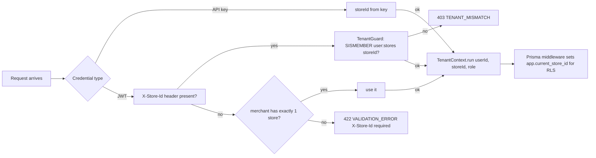

# Authentication & Authorization

> Who may call what, with which credential, and how every claim is verified.
> Implementation: `packages/auth` (guards/strategies), `apps/backend/src/common/guards`.

---

## 1. Credential families

| | Interactive (dashboard/mobile) | Machine (integrations) | Partner (OAuth2) |
|---|---|---|---|
| Credential | Access JWT + refresh token | `X-API-Key` header | `Authorization: Bearer` (1 h JWT) |
| Obtained via | `POST /auth/login`, `/auth/register`, `/auth/refresh` | `POST /stores/:id/api-keys` (OWNER only) | `POST /oauth/token` (client_credentials) |
| Scope of data | all stores user belongs to | exactly one store | merchant-wide, read-scoped |
| Revocation | logout / revokeAll on password change | DELETE api-key (instant) | secret rotation |
| Storage advice web | access in memory; refresh in httpOnly SameSite=Lax cookie | n/a | n/a |
| Storage advice mobile | Expo SecureStore both tokens | n/a | n/a |
| Storage advice server | env/secret manager | env/secret manager | env/secret manager |

## 2. Access token (JWT)

```json
// header
{ "alg": "RS256", "kid": "2026-Q1", "typ": "JWT" }
// payload — verified claims only; nothing queryable lives in the token
{
  "iss": "wco-api",
  "sub": "usr_2nb...",            // userId
  "merchantId": "mrc_9xk...",
  "role": "OWNER",                 // UserRole enum snapshot
  "email": "demo@wco.app",
  "iat": 1769856000,
  "exp": 1769856900               // +900 s
}
```

- **RS256** with 2048-bit keys; public key published at `/.well-known/jwks.json`
  for resource servers and SDK verification. Rotation: new `kid` quarterly,
  old key verify-only for 30 days.
- Stateless verification (signature + exp). Anything volatile (ban, membership)
  is checked against Redis/DB per request by guards, never trusted from the token.
- Leaked-token blast radius ≤ 15 minutes and read/write limited to the principal's stores.

## 3. Refresh tokens

- Opaque 48-byte base64url strings (not JWTs): nothing to decode if leaked.
- Stored in Redis `rt:{token}` → `{userId, familyId, ip}` TTL 7 d; DB keeps no copy.
- **Single-use rotation**: each refresh deletes the presented token and issues a new one.
- **Reuse detection**: presenting a consumed token revokes the entire family → 401.
- Password change / role demotion / explicit logout-all → `revokeAllForUser`.

## 4. API keys

Format `wco_<storeId6>_<secret32>` (see `ApiKeyService`). Properties:

- SHA-256 hash persisted (`api_tokens.tokenHash`) with display `prefix`; raw shown once.
- Store-scoped by construction: the key itself carries its store binding; requests
  must omit or match `X-Store-Id` (`TENANT_MISMATCH` otherwise).
- Optional `expiresAt` for contractor keys; `lastUsedAt` updated hourly (batched).
- Gateway resolves keys to consumers so rate buckets and audit trails are per-key.

Role mapping for API keys: implicit **AGENT** for reads/writes listed in the route's
API-key column of the matrix below.

## 5. Store scoping (multi-store)



Rules:

1. Membership is checked per request (Redis set cached 60 s, invalidated on role change).
2. The resolved context is authoritative end-to-end; services never accept a client-supplied
   storeId in bodies for scoping decisions (body values are payloads, not authority).
3. Cross-store references (e.g., creating an order for a customer of another store) fail
   at FK + RLS layers regardless of API behavior — defense in depth.

## 6. RBAC model

Roles are per-user global to the merchant (`users.role`), mapped to capability checks
in `RolesGuard` via `@Roles(...)` decorators. Permissions are evaluated as:
**credential scope ∧ route roles ∧ store membership**.

### Capability matrix

| Module · action | OWNER | ADMIN | AGENT | VIEWER | API key | Partner scopes |
|---|---|---|---|---|---|---|
| auth/me update | ✅ | ✅ | ✅ | ✅ | — | profile:read |
| users manage (invite/role/deactivate) | ✅ | ❌ | ❌ | ❌ | ❌ | — |
| stores create/delete, whatsapp connect | ✅ | ❌* | ❌ | ❌ | ❌ | — |
| products/customers/orders/deliveries write | ✅ | ✅ | ✅ | ❌ | ✅ | *:write |
| conversations send/takeover | ✅ | ✅ | ✅ | ❌ | ✅* | messages:write |
| payments refund | ✅ | ✅ | ❌ | ❌ | ❌ | payments:write |
| payment-methods (payout accounts) | ✅ | ❌ | ❌ | ❌ | ❌ | — |
| subscriptions manage | ✅ | ❌ | ❌ | ❌ | ❌ | billing:read |
| ai-configs write | ✅ | ✅ | ❌ | ❌ | ❌ | ai:write |
| analytics read | ✅ | ✅ | ✅ | ✅ | ✅ | *:read |
| webhook subs manage | ✅ | ✅ | ❌ | ❌ | ❌ | webhooks:manage |
| delivery-providers write | 🛡 platform | 🛡 | ❌ | ❌ | ❌ | — |

\* ADMIN may connect numbers but cannot delete stores. AGENT-scoped API keys may send
messages only within their bound store.

Escalation path: OWNER invites users (`POST /users`), assigns roles (`PUT /users/:id`);
every role change writes an AuditLog row and revokes the target's sessions when demoted.

## 7. OAuth 2.0 details (partner tier)

```
POST /api/v1/oauth/token
Authorization: Basic <client_id:client_secret>
Content-Type: application/x-www-form-urlencoded

grant_type=client_credentials&scope=orders%3Aread%20products%3Aread
```

Response:

```json
{ "access_token": "eyJhbGciOi...", "token_type": "Bearer", "expires_in": 3600, "scope": "orders:read products:read" }
```

- Clients provisioned off-line by partnerships team; secrets are 32-byte base64url,
  stored hashed, rotatable without downtime (dual-secret window 24 h).
- Scopes are coarse verbs per module; enforced by comparing route metadata to the
  `scope` claim after signature verification.
- No refresh tokens for this tier — clients re-auth hourly; token endpoint is cheap.

## 8. Route guard composition

Typical controller wiring (matches existing code):

```ts
@Controller({ path: 'orders', version: '1' })
@UseGuards(JwtAuthGuard, TenantGuard, RolesGuard)   // authenticate → tenancy → capability
@ApiBearerAuth()
export class OrdersController {
  @Post()
  @Roles('OWNER', 'ADMIN', 'AGENT')
  @UseInterceptors(IdempotencyInterceptor)
  create(@Body() dto: CreateOrderDto, @Req() req: FastifyRequest) { ... }
}
```

Evaluation order and failure codes:

1. `JwtAuthGuard` / ApiKeyStrategy / OAuthStrategy → 401 `UNAUTHORIZED`
2. `TenantGuard` (membership + X-Store-Id resolution) → 403 `TENANT_MISMATCH` / 422
3. `RolesGuard` (@Roles ∩ principal capabilities) → 403 `FORBIDDEN`
4. DTO ValidationPipe → 422 `VALIDATION_ERROR`

## 9. Session lifecycle edge cases

| Event | Effect |
|---|---|
| password change | revokeAllForUser + email notice |
| user deactivated | sessions revoked; tokens fail membership check within 60 s cache TTL max |
| merchant suspended | store status flips SUSPENDED; TenantGuard rejects with 403 STORE_SUSPENDED |
| refresh reuse detected | family revoked; security event `auth.refresh_reuse` logged w/ ip + ua |
| JWT key rotation | old kid verify-only 30 d; clients unaffected (JWKS cached ≤ 24 h) |

## 10. Webhook credentials (outbound)

Per-subscription `whsec_…` secrets (32 bytes). Signature covers timestamp + raw body:

```
X-WCO-Signature: t=1769856000,v1=HMAC_SHA256(secret, `${t}.${rawBody}`)
```

Timestamp tolerance ±5 min blocks replay. Secrets rotate via `POST /webhooks/:id/rotate`
(old accepted 24 h overlap). Full contract in [webhooks.md](./webhooks.md).
