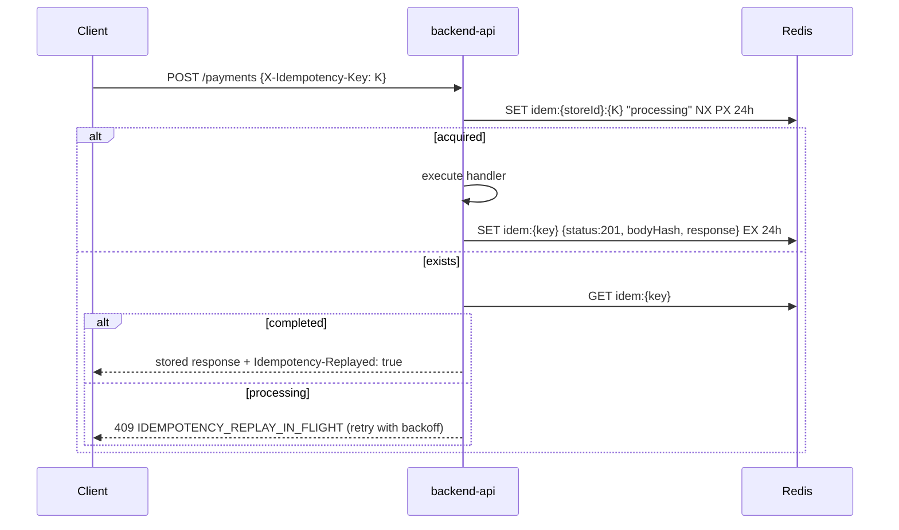

# API Design Guidelines

> The rules every WCO endpoint follows. Enforced by: `@nestjs/swagger` decorators +
> `openapi.yaml` lint (Spectral ruleset in CI), shared DTO validators, and the global
> exception filter. A PR that violates any "MUST" here does not merge.

---

## 1. RESTful principles

1. **Resources, not verbs.** Nouns in paths (`/orders`), actions expressed by HTTP
   methods. State-machine transitions that don't map cleanly to CRUD get explicit,
   idempotent sub-resources (`POST /orders/:id/status`, `POST /payments/:id/refund`).
2. **Uniform interface.** Same auth, same error envelope, same pagination envelope,
   same tenancy header everywhere — a client that learned one module knows them all.
3. **Statelessness.** No server-side sessions for API callers; credentials travel with
   every request. (Refresh tokens are credentials, not sessions.)
4. **Cacheability.** Every GET declares its cache policy via `ETag`, `Cache-Control`,
   or explicit `no-store`.
5. **Layered tolerance.** Clients must treat unknown fields as inert and unknown enum
   values as their `_UNKNOWN` fallback — we add fields/enums without version bumps.

## 2. Resource naming conventions

| Rule | Good | Bad |
|---|---|---|
| Plural nouns, kebab-case | `/payment-methods` | `/getPaymentMethods`, `/payment_methods` |
| Two levels max of nesting; then reference by id | `/customers/:id/orders` | `/stores/:sid/customers/:cid/orders/:oid/items` |
| Actions as verb sub-resources on the affected entity | `POST /orders/:id/status` | `GET /updateOrderStatus` |
| Query params camelCase | `?sortBy=createdAt&order=desc` | `?sort_by=created_at` |
| No file extensions, no trailing slashes | `/products/:id` | `/products/:id.json` |
| Ids are opaque strings (cuid) | `ord_7f3k9q…` | sequential ints |

Resource → path prefix map:

```text
merchants  users  stores  customers  products  orders  payments
payment-methods  deliveries  delivery-providers  subscriptions
ai-configs  analytics  webhooks  whatsapp  messages  health
```

## 3. HTTP methods

| Method | Semantics | Idempotent? | Body | Used for |
|---|---|---|---|---|
| GET | Read; **never** mutates | yes | no | all reads, stats, exports |
| POST | Create resource or fire action | only via `X-Idempotency-Key` | yes | create + transitions (`/refund`, `/status`) |
| PUT | Full/partial update (upsert-style) | yes | yes | user-specified update routes |
| PATCH | Partial update — alias of PUT on same routes | yes | yes | preferred by first-party clients |
| DELETE | Remove or soft-delete | yes | no | catalog removals, webhook subs |

**PUT/PATCH duality:** both verbs hit identical handlers on update routes
(gateway rewrites PATCH→PUT upstream). Spec documents `put`; clients may send either.
Rationale: partner specs asked for PUT; our dashboard prefers PATCH; supporting both
costs one rewrite rule and removes a whole class of 405 support tickets.

### Status-code usage

| Code | When | Example |
|---|---|---|
| 200 OK | successful read/action incl. accepted replays | `GET /orders`, replayed idempotent POST |
| 201 Created | resource created; `Location` header set | `POST /orders` |
| 202 Accepted | async processing started | `POST /marketing/campaigns/:id/launch` |
| 204 No Content | success with no body | `DELETE /webhooks/:id`, logout |
| 304 Not Modified | `If-None-Match` matched current ETag | cached `GET /analytics/dashboard` |
| 400 Bad Request | malformed JSON / unparseable body | broken JSON syntax |
| 401 Unauthorized | missing/expired/invalid credentials | expired JWT |
| 402 Payment Required | business payment failure | `PAYMENT_FAILED` from PSP |
| 403 Forbidden | authenticated but not permitted / wrong tenant | AGENT hitting owner-only route, `TENANT_MISMATCH` |
| 404 Not Found | absent **or** belongs to another tenant (no existence leak) | foreign storeId order |
| 409 Conflict | state precondition failed | duplicate SKU, `INSUFFICIENT_STOCK`, illegal status transition |
| 410 Gone | resource hard-deleted per GDPR erasure | erased customer |
| 422 Unprocessable Entity | semantically invalid body | validation errors array |
| 429 Too Many Requests | rate limited; `Retry-After` always set | burst exceed |
| 500 Internal | unhandled fault (paged on-call) | bug |
| 503 Service Unavailable | dependency outage, circuit open | PSP down |

Never invent statuses outside this table. 4xx = caller's problem (no alert);
5xx = ours (alert + paged if SLO-burning).

## 4. Request/response conventions

- Bodies are JSON (`Content-Type: application/json; charset=utf-8`); UTF-8 end-to-end.
- All list endpoints return an envelope:
  `{ "items": [...], "meta": { … } }` — never a bare array (evolvability).
- Create/update responses return the **full representation** of the resource after mutation.
- Timestamps RFC 3339 UTC; ids opaque strings prefixed by type
  (`usr_ mrc_ str_ cst_ prd_ vnt_ ord_ itm_ pay_ pm_ dlv_ prv_ sub_ pln_ ai_ tpl_ wh_ msg_ cnv_`).
- Booleans positive-named (`isActive`, not `disabled`).
- Enums SCREAMING_SNAKE matching DB enums exactly.

## 5. Error handling

Single envelope for every failure (successes keep their resource shape):

```json
{
  "code": "VALIDATION_ERROR",
  "message": "Request validation failed",
  "requestId": "req_01HQ...",
  "details": {
    "errors": [
      { "path": "body.items[0].quantity", "code": "min", "message": "must be >= 1" }
    ]
  }
}
```

Rules:

- `code` is from the stable catalog below — never free-form text.
- `message` is human-safe English; localized copies ship via client bundles, not API.
- `requestId` echoes `X-Request-ID` — include it verbatim in bug reports.
- Validation reports **all** offending fields at once (`stopAtFirstError=false`).
- 404 never distinguishes "missing" from "foreign-tenant" (enumeration defense).
- Stack traces, SQL, provider payloads never cross the boundary (stripped in filter).

### Error code catalog

| code | HTTP | Retryable | Meaning / caller fix |
|---|---|---|---|
| `VALIDATION_ERROR` | 422 | no | fix fields listed in details |
| `UNAUTHORIZED` | 401 | after refresh | missing/expired token → refresh flow |
| `FORBIDDEN` | 403 | no | role/scope lacks permission |
| `TENANT_MISMATCH` | 403 | no | X-Store-Id not accessible to principal |
| `NOT_FOUND` | 404 | no | bad id or foreign resource |
| `CONFLICT` | 409 | maybe* | duplicate key / stale ETag / illegal transition (*re-fetch then retry) |
| `INSUFFICIENT_STOCK` | 409 | re-read | stock moved under you |
| `PAYMENT_FAILED` | 402 | no | PSP declined; see details.reason |
| `RATE_LIMITED` | 429 | yes, after Retry-After | back off |
| `IDEMPOTENCY_REPLAY_IN_FLIGHT` | 409 | yes | original request still executing |
| `PROVIDER_UNAVAILABLE` | 503 | yes | upstream PSP/logistics/Meta down |
| `INTERNAL_ERROR` | 500 | yes, sparingly | our bug; alert fires automatically |

Adding a code requires: shared/errors entry, this table row, Spectral enum update — one PR.

## 6. Pagination, filtering, sorting, search

### Pagination

Cursor-first everywhere (stable under concurrent writes):

```
GET /orders?limit=20&cursor=ord_9x8y...
→ { "items": [...], "meta": { "nextCursor": "ord_ab12...", "hasMore": true } }
```

- `limit`: 1–100, default 20 (messages default 50).
- Opaque cursor = base64(`{sortField}:{lastId}`) — tamper-proof, no offset drift.
- Offset style (`?page=2&limit=20` + `meta.total`) allowed **only** where datasets are
  bounded (<10k rows): subscription plans, delivery providers, users.
- Deep-pagination guard: cursor pages beyond 10,000 items require narrower filters.

### Filtering

Whitelisted exact-match params per resource, comma-multi-valued:

```
GET /orders?status=PAID,PROCESSING&customerId=cst_...&createdAfter=2026-01-01T00:00:00Z
GET /products?status=ACTIVE&categoryId=cat_...&lowStock=true
GET /messages/threads?status=BOT&unassigned=true
```

Unknown filter keys → 422 `VALIDATION_ERROR` (fail loud, not silent ignore).

### Sorting

`?sortBy=<field>&order=asc|desc` — compound via comma (`sortBy=status,createdAt`);
sortable fields whitelisted per resource and always backed by a composite index
(see database/indexing-strategy.md). Default sorts documented per endpoint
(e.g., orders `-createdAt`, threads `-lastMessageAt`).

### Search

`?q=` full-text where supported (products name/SKU, customers name/phone):
PG trigram prefix-match up to 3 chars, tsquery beyond; Elasticsearch mirrors behind
feature flag for >100k-row stores (see database/redis-elasticsearch.md).
Search endpoints cap `limit` at 50 and skip counts (cursor meta only).

## 7. Idempotency

All unsafe POST/PUT routes accept `X-Idempotency-Key` (UUID recommended):



Scope: key uniqueness is `(storeId, key)` — two stores may reuse a key safely.
Window: 24 h. Keys are honored on POST/PUT even when bodies differ (first wins;
mismatch logged as suspected client bug).

## 8. Versioning & deprecation policy

- **URL versioning**: `/api/v1/...`. New major only for breaking changes.
- Within v1: additive changes (new optional fields, new enums values, new endpoints) ship freely.
- Removals follow the contract: mark deprecated in spec ≥ 90 days before, emit
  `Deprecation: true` + `Sunset: <date>` headers, notify key owners by email,
  track usage dashboards to zero before deleting.
- Legacy aliases from v0 (README table) carry the same headers today.

## 9. Concurrency control

Mutable aggregates (product, order status, AI config, store settings) expose weak
ETags: `ETag: "v<updatedAtEpoch>"`. Writers pass `If-Match`; mismatch → `409 CONFLICT`
with `code=STALE_WRITE`. Clients that don't send If-Match get last-write-wins
(dashboard always sends it).

## 10. Sparse fieldsets & expansion

- `?fields=id,name,price` trims responses (whitelisted per resource).
- `?expand=customer,delivery` embeds related resources inline instead of N+1 client calls.
  Expand depth ≤ 1; expansions are cache-key dimensions.

## 11. Money, dates, and locales

- Amounts: JSON strings in major units (`"1500.50"`), paired with ISO 4217 `currency`.
  Never floats; DB keeps DECIMAL(14,2) — string transport avoids JS precision loss.
- Dates: RFC 3339 UTC in/out; `?timezone=Africa/Lagos` accepted by analytics day-bucketing.
- Phone numbers: E.164 strings (`+2348012345678`).

## 12. Rate-limit tiers

Redis sliding-window counters keyed by principal (user id / API-key id / IP for anon),
enforced at gateway (ceiling) and app (fine tiers). Response headers always present:

```
RateLimit-Limit: 100
RateLimit-Remaining: 97
RateLimit-Reset: 12            # seconds to window reset
Retry-After: 12                # on 429 only
```

| Tier | Limit | Applies to |
|---|---|---|
| `auth` | 5/min/IP · 10/min/email · 3/day/reset-email | login, register, password flows |
| `standard` | 100/min/principal, burst 20/s | all tenant REST |
| `read-heavy` | 240/min/principal | `/analytics/*`, exports |
| `ai-test` | 10/min/store | `/ai-configs/test` (LLM cost guardrail) |
| `ingest` | 5,000/min/IP | inbound webhooks |
| `admin` | 30/min/token | `/admin/*` |

Plan tier multiplies `standard` (FREE ×1, STARTER ×2, GROWTH ×5, SCALE ×20).

---

## Appendix: endpoint matrix (human-readable index)

Full schemas live in [openapi.yaml](./openapi.yaml). Auth legend: 🔓 public · 👤 JWT · 🔑 API key · 🛡 platform admin.

| Module | Endpoint | Auth | Notes |
|---|---|---|---|
| Auth | `POST /auth/register` | 🔓 | creates merchant+owner; 5/min |
| | `POST /auth/login` | 🔓 | returns pair; throttled per email |
| | `POST /auth/logout` | 👤 | revokes refresh family |
| | `POST /auth/refresh` | 🔓* | rotation; *reuse kills family |
| | `POST /auth/password/reset` | 🔓 | always 202 (no user enumeration) |
| | `POST /auth/password/confirm` | 🔓 | token from email; revokes all sessions |
| | `GET·PUT /auth/me` | 👤 | profile read/update |
| Users | `GET /users`, `GET·PUT·DELETE /users/:id` | 👤 OWNER/ADMIN | team management; DELETE = deactivate |
| Stores | `GET·POST /stores` | 👤 | membership-filtered list |
| | `GET·PUT·DELETE /stores/:id` | 👤+member | slug immutable |
| | `POST /stores/:id/api-keys` | 👤 OWNER | returns raw key once |
| | `POST /whatsapp/connect` etc. | 👤 OWNER | see whatsapp module |
| Customers | `GET·POST /customers`, `GET·PUT·DELETE /customers/:id` | 👤🔑 AGENT+ | GDPR export/delete included |
| | `GET /customers/:id/orders` · `/messages` | 👤🔑 | 360 views |
| Products | `GET·POST /products`, `GET·PUT·DELETE /products/:id` | 👤🔑 AGENT+ | soft delete |
| | `POST /products/:id/variants`, `PUT·DELETE /…/:variantId` | 👤🔑 | variant CRUD |
| | `GET /products/search?q=` | 👤🔑 | trigram/tsquery |
| Orders | `GET·POST /orders`, `GET·PUT·DELETE /orders/:id` | 👤🔑 AGENT+ | delete only when PENDING_PAYMENT |
| | `PUT /orders/:id/status` | 👤🔑 | state machine enforced |
| | `GET /orders/:id/items` · `/orders/stats` | 👤🔑 | stats cached 60 s |
| Messages | `GET /messages/threads` · `/threads/:id` | 👤 AGENT+ | conversations backing |
| | `POST /messages/threads/:id` | 👤 | agent send → takeover |
| | `GET /messages/stats` | 👤 | resolution rate etc. |
| Payments | `GET·POST /payments`, `GET·PUT /payments/:id` | 👤🔑 | links + verification |
| | `POST /payments/:id/refund` | 👤 OWNER/ADMIN | **POST, not GET** (see §1 note below) |
| | `GET /payments/stats` · webhooks inbound | 👤 / HMAC | — |
| Payment methods | `GET·POST /payment-methods`, `GET·PUT·DELETE /:id` | 👤 OWNER | payout accounts; secrets write-only |
| Deliveries | `GET·POST /deliveries`, `GET·PUT /deliveries/:id` | 👤🔑 | quotes/book via POST |
| | `GET /deliveries/:id/track` · `/deliveries/stats` | 👤🔑 | provider proxy w/ 60 s cache |
| Delivery providers | `GET /delivery-providers(/:id)` | 👤🔑 | registry read |
| | `POST·PUT·DELETE /delivery-providers/:id` | 🛡 | platform ops only |
| Subscriptions | `GET·POST·PUT·DELETE /subscriptions` | 👤 OWNER | DELETE = cancel at period end |
| | `GET /subscriptions/plans` | 🔓 | public pricing |
| | billing webhooks | HMAC | inbound |
| AI configs | `GET·PUT /ai-configs` | 👤 OWNER/ADMIN | one per store |
| | `POST /ai-configs/test` | 👤 | 10/min LLM sandbox |
| | templates CRUD under `/ai-configs/responses*` | 👤 OWNER/ADMIN | system templates read-only |
| Analytics | `GET /analytics/{sales,customers,products,messages,payments,deliveries,dashboard}` | 👤 VIEWER+ | 60 s cache, day buckets honor timezone |
| Webhooks | `GET·POST /webhooks`, `GET·PUT·DELETE /webhooks/:id` | 👤 OWNER/ADMIN | secret shown once |
| | `POST /webhooks/:id/test` | 👤 | sample event fire |
| WhatsApp | `POST /whatsapp/{connect,disconnect}`, `GET /whatsapp/status` | 👤 OWNER | number globally unique |
| Platform | `GET /health` 🔓 · `GET /status` 🔓 · `GET /metrics` internal | — | liveness/readiness/Prometheus |
