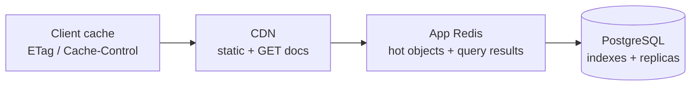

# API Performance

> Budgets, caching layers, and payload discipline. SLO: p99 ≤ 400 ms gateway→client
> for reads, ≤ 800 ms for writes (excl. provider calls), at 100K req/s aggregate.

---

## 1. Latency budgets per request

| Segment | Read budget | Write budget |
|---|---|---|
| CDN + Kong edge | 10 ms | 10 ms |
| Authn + tenancy guard (Redis) | 2–3 ms | 2–3 ms |
| Business logic + PostgreSQL | 150 ms | 300 ms |
| Provider calls (payments/logistics) | — | 500 ms (parallelized) |
| Serialize + gzip/brotli | 15 ms | 15 ms |

Regression gate: k6 suite in CI fails PR if synthetic p95 regresses >15%.

## 2. Caching strategy (four layers)



| Layer | What | TTL | Invalidation |
|---|---|---|---|
| Browser/app | ETag on mutable reads; `Cache-Control: private, max-age=30` on analytics/dashboard | 30 s | conditional revalidation (304 path costs ~1 ms) |
| CDN | OpenAPI docs, public plan catalog `GET /subscriptions/plans` | 5 min | deploy-time purge |
| Redis — object | AI configs (loaded every AI turn), store settings, user↔store membership | 5 min · 60 s | write-through delete-on-update via domain events |
| Redis — computed | `/analytics/*` aggregates, `/orders/stats`, delivery track responses, rate-limit counters | 60 s · 60 s · 60 s · window | TTL only (cheap recompute) |

Rules:

- Cache keys namespaced by tenant: `v1:{storeId}:orders:list:{hash(filters+cursor)}` —
  never a global key (cross-tenant leak risk).
- Writes invalidate precisely: command handlers publish `{resource}.mutated` events;
  a generic invalidator deletes affected keys (no time-based guessing).
- Conditional GETs: strong ETags from row version; `If-None-Match` → 304 saves ~90%
  of dashboard polling bytes.

## 3. Compression

Brotli (`br`, level 4 dynamic) preferred, gzip fallback for legacy agents; enabled at
Kong and confirmed in-app for direct dev access:

```
Accept-Encoding: br,gzip
Content-Encoding: br        # JSON shrinks 80–85% typically
Vary: Accept-Encoding
```

SSE/streaming endpoints (message tail) use identity encoding to avoid buffering.

## 4. Payload discipline

- **Pagination everywhere** (cursor-first) — no unbounded lists, ever.
  Caps: limit ≤ 100 (50 for search/messages), expand depth ≤ 1.
- **Sparse fieldsets** `?fields=` trim wide resources (products with 20+ fields).
- **Envelope stability**: unknown-field tolerance lets us add fields without client breaks,
  so we never need "fat" v0-style responses.
- Numeric money as strings avoids float bloat/precision bugs simultaneously.

## 5. Partial responses & batching

### GraphQL for aggregation reads

Dashboard landing page needs orders + customers + deliveries + stats in one round trip:

```graphql
query Dashboard($storeId: ID!) {
  dashboard(storeId: $storeId, range: last7days) {
    revenue ordersCount newCustomers aiResolutionRate
    topProducts(limit: 5) { id name units revenue }
    recentOrders(limit: 8) { id orderNumber status total customer { name } }
  }
}
```

Single HTTP call replaces four REST calls; DataLoader batches + dedupes entity loads
per request (see [graphql.md](./graphql.md)). REST remains canonical for mutations.

### Batch endpoints where GraphQL doesn't fit

`POST /orders/batch` accepts up to 50 create-items atomically-per-item (per-item result
array), used by CSV importers — one TCP round trip instead of 50, each item still gets
its own validation outcome.

## 6. Database-facing performance rules

- Every list endpoint's default sort matches a composite index (indexing-strategy.md §"API parity").
- Keyset pagination keeps deep pages O(1) (no OFFSET scans); offset style restricted
  to small sets by design.
- N+1 ban: Prisma `include`/`select` reviewed per endpoint; DataLoader inside GraphQL.
- Heavy exports (`/customers/:id/export`) stream NDJSON instead of buffering arrays.
- Connection pool sized per pod; pgBouncer absorbs bursts; read replicas serve
  `/analytics/*` and export jobs via replica-aware repository routing.

## 7. Concurrency & backpressure

- Idempotency keys double as natural request coalescing for retry storms.
- Per-store write concurrency caps (queue depth → 429 with Retry-After) prevent one
  noisy merchant from starving others at the DB pool.
- Circuit breakers fail fast (503 + Retry-After) instead of piling latency when PSPs degrade.

## 8. Measured baselines (staging, 2026-02 load test)

| Endpoint mix | RPS | p50 | p95 | p99 |
|---|---|---|---|---|
| GET /products?limit=20 (warm cache) | 12k | 18 ms | 41 ms | 88 ms |
| GET /orders?limit=20 (cold) | 8k | 34 ms | 96 ms | 190 ms |
| POST /orders (3 items) | 2k | 61 ms | 180 ms | 420 ms |
| POST /messages/threads/:id (send) | 5k | 45 ms | 120 ms | 260 ms |
| GET /analytics/dashboard (60 s cache) | 9k | 9 ms | 22 ms | 60 ms |

Methodology and reproducible scripts: [testing.md §Load testing](./testing.md#4-load-testing).
