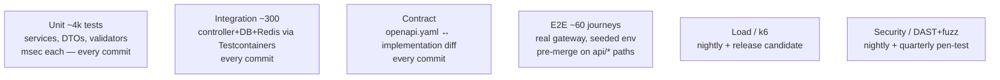

# API Testing Strategy

> The API contract is guarded by five test layers. CI blocks merges on the first three;
> load and security suites run nightly + pre-release.

---

## 1. Pyramid & ownership



## 2. Unit tests

Scope: services with mocked repositories, DTO validators, state machines, money utils,
signature verifiers, RBAC guard logic.

```ts
describe('OrdersService.create', () => {
  it('rejects items when stock is insufficient (INSUFFICIENT_STOCK)', async () => {
    productRepo.findMany.mockResolvedValue([product({ stockQuantity: 1 })]);
    await expect(svc.create(orderDto({ quantity: 2 })))
      .rejects.toMatchObject({ code: 'INSUFFICIENT_STOCK' });
  });
  it('writes order + outbox event in one transaction', async () => { /* assert tx boundary */ });
});
```

Rules: error codes asserted by `code` not message text; every service method has at
least one happy + one failure case; state machines table-driven.

## 3. Integration tests

Real PostgreSQL 15 + Redis via **Testcontainers**, migrations applied from
`packages/database/prisma/migrations` (the same artifacts prod uses), RLS enabled,
seeded with the canonical seed. Each suite boots the Nest app with overridden
provider adapters (PSP/logistics/WhatsApp behind msw-style stubs).

Coverage targets per module: CRUD happy paths, tenant isolation (**user A must never
read user B's rows — parameterized over every list endpoint**), validation failures,
idempotent replay, cursor stability under concurrent inserts, ETag/If-Match conflicts.

Tenant-isolation test pattern (shared helper):

```ts
for (const route of TENANT_SCOPED_ROUTES) {
  it(`${route} never leaks cross-store data`, async () => {
    const resA = await request(app).get(route).set(auth(userOf(storeA)));
    const ids = extractIds(resA);
    expect(ids).not.toContain(anyIdFrom(storeB));
  });
}
```

## 4. Contract testing

- `openapi.yaml` is generated from Nest decorators (`@nestjs/swagger`) and **diffed**
  against the committed spec in CI (`oasdiff breaking`) — drift fails the build.
- Spectral enforces our lint ruleset (error envelope present, security per operation,
  pagination envelope on lists, no bare arrays, examples required on 4xx).
- Partner-facing SDKs compile against the spec as a canary (`openapi-generator` dry run).

## 5. End-to-end tests

Playwright API runner against docker-compose full stack (gateway → services → PG/Redis/RMQ):

| Journey | Asserts |
|---|---|
| register → login → create store → connect whatsapp (sandbox) | 201s, Location headers, status endpoint flips READY |
| seed catalog → create order → pay link → simulate PSP webhook | order PAID, webhook processed exactly once (replay ignored) |
| inbound customer WA message → AI reply < 5 s → agent takeover | thread statuses BOT→HANDLED, audit rows |
| quote → book delivery → track callback | delivery IN_TRANSIT, stats increment |
| refund flow incl. idempotent double-submit | one refund row; second call replays stored response |
| GDPR export then delete | export NDJSON complete; subsequent GET → 410 |

Flake policy: quarantine label + 48 h fix SLA; E2E cannot be skipped silently.

## 6. Load testing (k6)

Scenarios mirror production mix (performance.md §8 baselines) with staged ramp:

```js
export const options = {
  scenarios: {
    browse: { executor: 'ramping-vus', stages: [
      { duration: '2m', target: 500 }, { duration: '5m', target: 2000 }, { duration: '2m', target: 0 }]},
  },
  thresholds: { http_req_duration: ['p(95)<250'], http_req_failed: ['rate<0.001'] },
};
```

Nightly against a staging cluster with production-shaped data volumes
(messages table ≥ 50M rows) so partitioning and index behavior are real.
Release gate: compare p95/p99 vs baseline report; >15% regression blocks launch.

## 7. Security testing

- **DAST**: ZAP baseline scan nightly on staging (auth session scripted).
- **Fuzzing**: schema-based payload fuzz on write endpoints (invalid enums, oversized
  strings, unicode edges, duplicate idempotency keys) — asserts 4xx envelope, never 500.
- **Authz matrix suite**: generated from the capability matrix — every role × protected
  route combination executed; any 2xx where 403 expected fails CI.
- **Secrets scanning**: gitleaks on every PR; container/image CVE gate (high=block).
- Quarterly external pen-test; findings tracked with SLAs by severity.

## 8. Toolchain summary

| Layer | Tools |
|---|---|
| Unit/integration | Jest, Testcontainers-node, supertest |
| Contract | @nestjs/swagger, oasdiff, Spectral |
| E2E | Playwright (API mode) + docker-compose |
| Load | k6 + Grafana cloud staging |
| Security | ZAP, custom fuzzers, gitleaks, Trivy |
