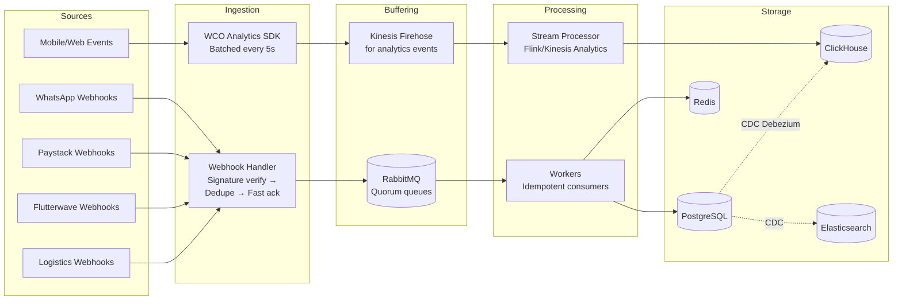
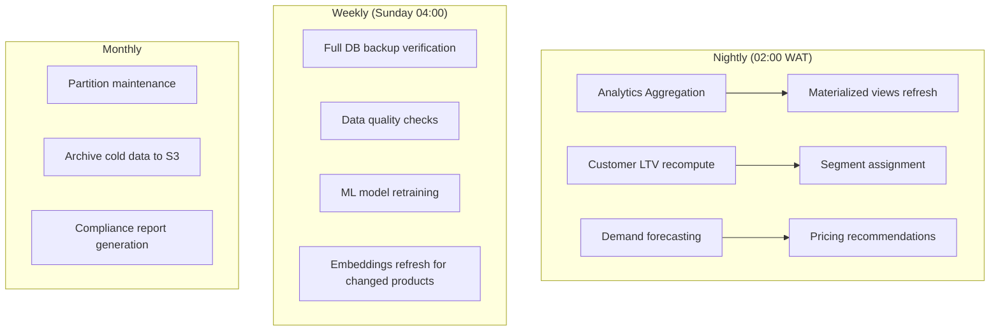
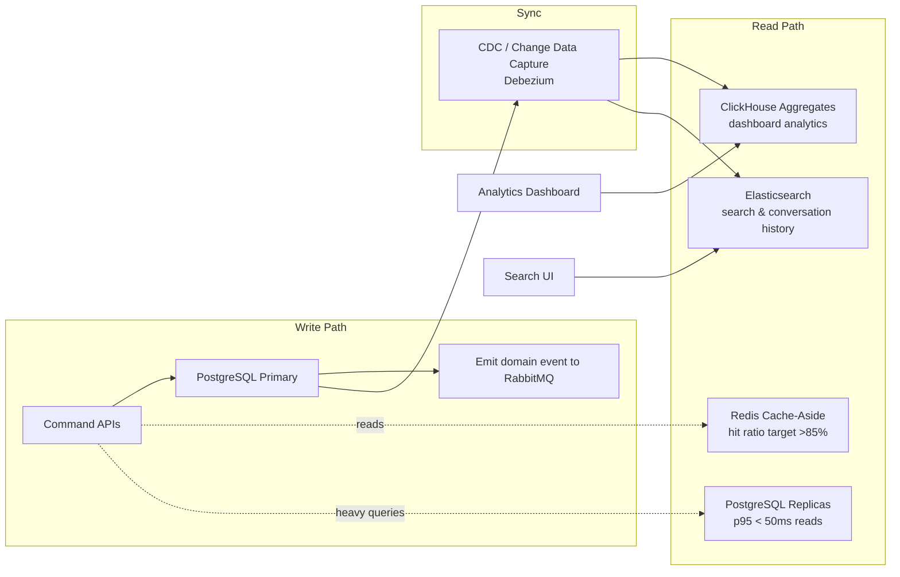
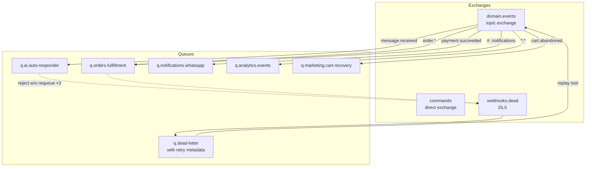
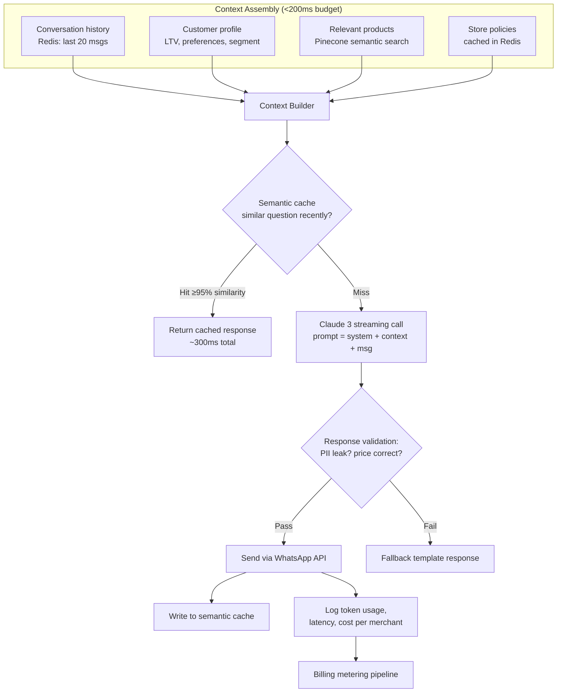
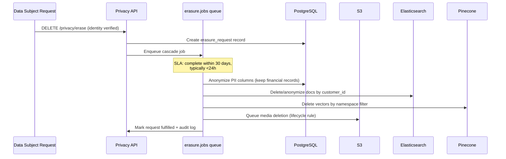

# WCO Data Flow Architecture

## Overview

This document details how data moves through the WCO system, covering ingestion paths, processing pipelines, storage strategies, and data lifecycle management.

## 1. Data Classification

| Class | Examples | Storage | Encryption | Retention |
|-------|----------|---------|------------|-----------|
| **PII-Critical** | Phone numbers, addresses, payment tokens | PostgreSQL (encrypted columns) | AES-256-GCM field-level | Per NDPR/GDPR policy |
| **Business Data** | Products, orders, customers | PostgreSQL | At-rest encryption | 7 years (tax law) |
| **Conversational** | WhatsApp messages, AI responses | PostgreSQL + Elasticsearch index | At-rest encryption | 24 months |
| **Behavioral** | Page views, clicks, events | ClickHouse | At-rest | 13 months |
| **Derived/ML** | Embeddings, forecasts, segments | Pinecone + PG | N/A | Regenerable |
| **Media** | Product images, logos | S3 + CloudFront | SSE-S3 | Until deleted |
| **Secrets** | API keys, tokens | AWS Secrets Manager | KMS CMK | Rotated 90d |

## 2. Ingestion Paths

### 2.1 Real-Time Streams



**Key guarantees:**
- **At-least-once delivery**: All webhooks acked only after durable enqueue
- **Idempotency**: Every webhook carries provider event ID; Redis dedupe window 72h
- **Ordering**: Per-conversation ordering via consistent-hash exchange on `wa_phone_number`
- **Backpressure**: Webhook handler returns 200 immediately; queue absorbs bursts up to 50K msg/s

### 2.2 Batch Pipelines



## 3. Read vs Write Path Separation (CQRS-Lite)



**Rules:**
- Writes always hit primary; reads prefer cache → replica → primary fallback
- Eventual consistency window: < 2s typical; UI uses optimistic updates + refetch
- Dashboard analytics NEVER query OLTP tables directly — always ClickHouse aggregates

## 4. Caching Strategy

| Layer | What | TTL | Invalidations |
|-------|------|-----|---------------|
| Browser/CDN | Static assets, JS/CSS bundles | Immutable, hashed filenames | Deploy = new hashes |
| Cloudflare | Product images, public catalog pages | 24h + stale-while-revalidate | Purge API on product change |
| Redis L1 (app) | Session data, JWT blacklist, feature flags | 15m - 24h | Explicit on write |
| Redis L2 (entity) | Product, store, customer profiles | 5m - 1h | Event-driven: entity.updated |
| Request memo | Deduped identical queries in flight | ms | Automatic |

**Cache stampede protection:** Request coalescing with distributed locks (Redlock) + jittered TTLs (±10%).

## 5. Message Flow Patterns (RabbitMQ)

### Exchange Topology



### Reliability Semantics
- **Publishers**: Confirm mode ON, mandatory flag, persistent messages
- **Consumers**: Manual ack AFTER successful processing; prefetch=10; idempotent handlers keyed by event_id
- **Retries**: Exponential backoff via retry exchanges (1s → 4s → 16s → DLQ)
- **Poison pills**: After 3 failures → dead letter queue → PagerDuty alert if rate > threshold

## 6. AI Pipeline Data Flow



**Cost controls:** per-merchant token budgets, daily caps, cheap-model routing (Haiku) for FAQs, expensive models only for complex queries.

## 7. Search Indexing Flow

```
Product created/updated
   → domain event → indexer worker
   → transform to flat doc (denormalize store+category)
   → bulk index to Elasticsearch (refresh: 1s)
   → searchable within ~2s of save
```

Conversations indexed similarly for merchant search ("find chat where customer asked about refund").

## 8. Data Lifecycle & GDPR/NDPR Flows

### Right-to-Erasure (Article 17)


Financial records are pseudonymized, not deleted (legal retention), with access restricted.

### Data Export (Article 20)
Generates machine-readable ZIP (JSON + CSV) of all customer data, signed URL emailed after identity verification.

## 9. Backup & Recovery Data Flows

| Asset | Method | Frequency | Retention | Restore Drill |
|-------|--------|-----------|-----------|---------------|
| PostgreSQL | WAL archiving + snapshots | Continuous + hourly snaps | PITR 35 days | Quarterly game day |
| Redis | RDB snapshots + AOF | Hourly | 7 days | Not restored (cache rebuild) |
| RabbitMQ | Quorum queues replicate ×3 | Continuous | n/a | Node loss auto-heals |
| S3 | Versioning + cross-region replication | Continuous | 90 days versioned | Monthly sample restore |
| ClickHouse | Distributed backups | Daily | 30 days | Quarterly |

**RPO: 5 minutes (WAL shipping). RTO: 15 minutes (automated runbook).**

## 10. Observability Data Flow

```
Every service → OpenTelemetry SDK
   ├─ Traces (sampled 10%, 100% errors) ──→ Jaeger / Datadog APM
   ├─ Metrics (Prometheus format, 15s scrape) → Mimir/Datadog
   └─ Structured JSON logs (correlation IDs) → Fluent Bit → ELK

Correlation ID propagation:
HTTP header X-Request-ID → AsyncLocalStorage → logs/traces/span tags
WhatsApp message_id becomes trace root for the entire reply pipeline.
```

Alert flow: Metric breach (e.g., ai_response_p99 > 7s for 5m) → Alertmanager → route by severity → PagerDuty (page) / Slack #alerts (warn) → auto-created incident with dashboard links.
