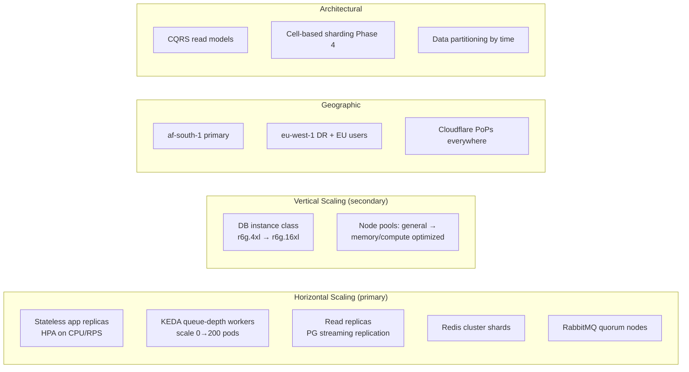
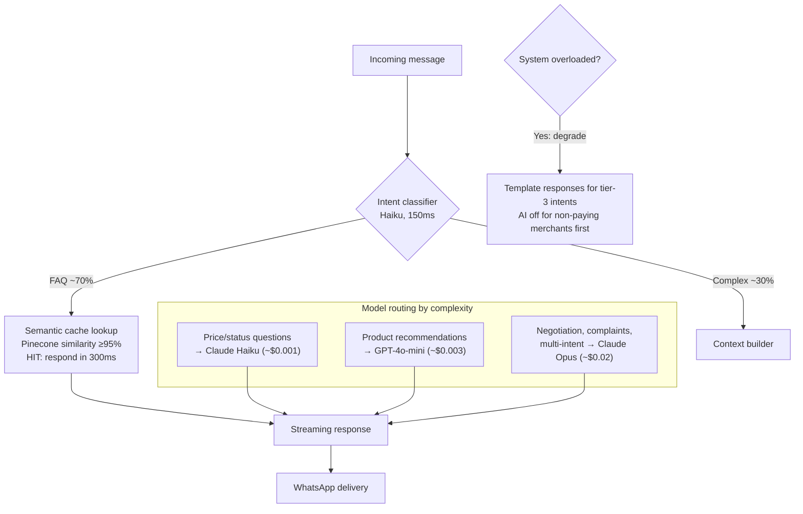
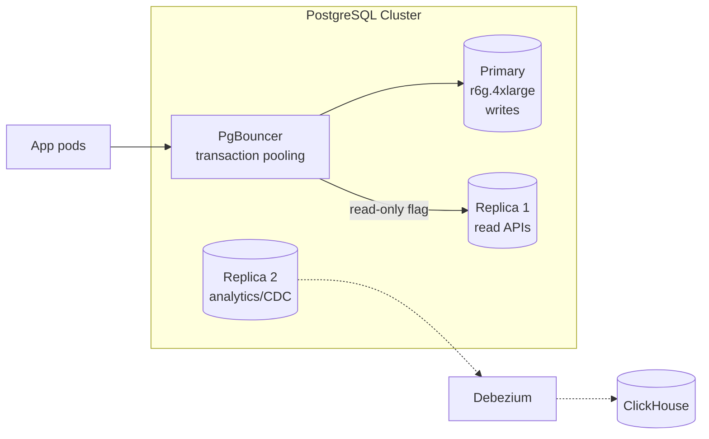

# WCO Scalability Plan

## Target Scale Definition

| Metric | Current (Launch) | 12 Months | 3-Year Target |
|--------|------------------|-----------|---------------|
| Merchants | 1K | 50K | **1M+** |
| WhatsApp messages/day | 50K | 5M | **100M+** |
| API requests/sec (peak) | 200 | 10K | **100K+** |
| AI generations/day | 20K | 2M | **40M+** |
| Payment transactions/day | 5K | 500K | **10M+** |
| Data volume (PG) | 50GB | 2TB | 20TB |
| Peak events | — | Black Friday ×10 traffic | ×25 flash-sale bursts |

**Design rule:** Every component must handle 10x current load without architecture change; 100x with pre-planned changes documented below.

---

## 1. Scaling Dimensions Overview



---

## 2. Layer-by-Layer Scaling Strategy

### 2.1 Edge & CDN Layer

| Concern | Strategy | Capacity |
|---------|----------|----------|
| Static assets | Cloudflare, immutable hashed filenames, `Cache-Control: max-age=31536000` | Effectively unlimited |
| Product images | R2/S3 + Cloudflare image resizing, WebP/AVIF negotiation | Unlimited |
| Public catalog pages | Full-page cache w/ stale-while-revalidate (60s TTL) | Absorbs viral merchant spikes |
| TLS termination | Cloudflare edge | DDoS absorption included |
| WAF | Managed ruleset + custom rate rules | L7 attack mitigation |

### 2.2 API Gateway / Load Balancing

- **AWS ALB** → target groups per service; cross-zone balancing
- **Rate limiting tiers** (Redis sliding window):
  - Auth endpoints: 5 req/min/IP
  - Standard API: 100 req/min/user
  - Webhook ingestion: 10K req/s burst (queue-based leveling)
  - Public catalog reads: CDN-shielded, effectively unlimited
- Connection draining 30s; health checks every 10s

### 2.3 Application Tier (NestJS)

**Statelessness contract:** No local state ever — sessions in Redis, files in S3, AsyncLocalStorage only within request scope.

```
Scaling profile per pod:
├── Backend API pod:     2 vCPU / 2GB   ~800 RPS mixed workload
├── Webhook handler:     1 vCPU / 512MB ~3K webhooks/s (verify+ack only)
├── Worker pods:         1 vCPU / 1GB   KEDA: scale = ceil(queue_depth / 500)
└── AI engine pod:       2 vCPU / 4GB   concurrency-limited by LLM quotas

HPA config:
  min/max replicas (prod): API 6→60 · webhook 4→40 · workers 0→200
  scaling policies: +100%/15s scale-up, -10%/60s scale-down (stabilization 300s)
  predictive scaling: pre-warm for known peaks (Fri 17-21h WAT, month-end)
```

**Node.js-specific tuning at scale:**
- `UV_THREADPOOL_SIZE=8` for DNS/crypto-heavy paths
- Fastify adapter on hot routes (-30% overhead vs Express)
- `--max-old-space-size` matched to container limits; graceful shutdown with SIGTERM drain (30s)
- Cluster mode NOT used — K8s replicates processes instead (better observability isolation)

### 2.4 AI Engine Scaling (the hard one)

AI is our cost & latency center. Multi-layer defense:



**Capacity math @ 100M msgs/day target:**
- 70% semantic-cache hit → 30M LLM calls/day
- Blended cost via Haiku-routing ≈ $0.002/call = **$60K/mo** (vs $400K naive all-Opus)
- Token budget enforcement: per-merchant daily caps in Redis (`INCR` + `EXPIRE`)
- Streaming everywhere: perceived latency <2s even for Opus-tier responses
- Concurrent generation cap: 500/pod × 50 pods; overflow → queue with priority by plan tier

### 2.5 Database Scaling Path

**Phase 1 (now → 2TB):** Vertical + replicas



- PgBouncer transaction mode: 20K client connections → 200 server connections
- Table partitioning from day one: `orders`, `messages`, `events` partitioned monthly
- Index discipline: every FK indexed; `EXPLAIN ANALYZE` gate in PR template for query changes

**Phase 2 (2TB → 10TB):** Functional partitioning
- Move conversations/messages to dedicated cluster (`chat-db`) — highest write volume
- ClickHouse owns ALL dashboard analytics queries
- Elasticsearch owns conversation search + history pagination

**Phase 3 (10TB+):** Tenant-aware sharding
- Shard key: `merchant_id` hash → 16 logical shards → citus or manual routing table
- Merchant never spans shards (enables per-shard maintenance)
- Enterprise tier: dedicated DB instance (isolation as a feature)

**Connection budget:**

| Service | Max conns to PG |
|---------|----------------|
| Backend API (60 pods × 5) | 300 |
| Workers (200 × 2) | 400 |
| Cron | 50 |
| Migrations (exclusive lock window) | 5 |
| **Total via PgBouncer** | **755 → 200 server-side** |

### 2.6 Cache Scaling

Redis Cluster: 3 primaries × 2 replicas, hash-tagged keys `{merchant:123}:products` ensures co-location.
Memory sizing rule: working set ≤ 60% of cluster memory; eviction `volatile-lru`; separate logical DBs → separate clusters when >100GB (sessions vs entity cache vs rate limits).

### 2.7 Queue Scaling

- Quorum queues ×3 replication; queue-length alerts >10K
- **Sharded queues** for hot consumers: `q.messages {shard 0..7}` via consistent-hash exchange
- DLQ replay tooling: `wco-cli dlq replay --filter=payment.* --dry-run`
- KEDA ScaledObject on RabbitMQ queue depth (already covered)

---

## 3. Load Testing & Capacity Verification

### k6 scenario (executed pre-launch and monthly):

```javascript
// tools/benchmark/k6-messages.js
import http from 'k6/http';
import { check } from 'k6';

export const options = {
  scenarios: {
    webhook_burst: {
      executor: 'ramping-arrival-rate',
      startRate: 100,
      timeUnit: '1s',
      stages: [
        { target: 5000, duration: '5m' },   // normal peak
        { target: 25000, duration: '10m' }, // black friday
        { target: 50000, duration: '5m' },  // breaking point test
      ],
      preAllocatedVUs: 2000,
      maxVUs: 20000,
    },
  },
  thresholds: {
    'http_req_duration{endpoint:webhook}': ['p(99)<200'],
    checks: ['rate>0.999'],
  },
};
```

**Pass criteria:** p99 webhook ack <200ms @ 50K/s; zero message loss; queue depth recovers <5min after spike ends.

### Bottleneck runbook (validated quarterly):

| Symptom | First bottleneck | Action |
|---------|------------------|--------|
| API latency ↑, CPU <60% | DB connection pool | Check PgBouncer wait time; scale pool/replica |
| Queue depth grows unbounded | Consumer throughput | KEDA max, then optimize handler N+1s |
| AI p99 >7s | Provider throttling | Shift traffic mix toward Haiku/cache |
| Redis latency spikes | Hot key / big value | Split hot keys, compress values >10KB |
| PG replica lag >30s | Long-running analytics query | Kill query, force route through ClickHouse |

---

## 4. Cost Scaling Model (COGS control)

Revenue-linked guardrails — infrastructure cost must stay <18% of revenue:

| Component | Per-unit economics @ scale | Control mechanism |
|-----------|---------------------------|-------------------|
| AI tokens | $0.002/msg blended | Semantic cache, model routing, per-merchant caps |
| Compute | ~$0.9/merchant/mo | Right-sizing, spot for workers (60%), KEDA scale-to-zero |
| Database | $0.35/merchant/mo | Partition pruning, archival to S3 Parquet after 12mo |
| Messaging | Pass-through + 12% margin | Meta pricing, template dedupe |
| Observability | $0.15/merchant/mo | Log sampling (errors 100%, info 1%), metric cardinality budget |

Projected COGS @ 1M merchants: **~$1.55/merchant/mo** vs ARPU $12 → healthy unit economics.

## 5. Scaling Anti-Patterns We Explicitly Avoid

1. ❌ Distributed monolith early — microservices before team size demands it
2. ❌ Two-phase-commit across services — sagas + idempotency instead
3. ❌ ORM lazy-loading in hot loops — explicit eager loading, dataloaders
4. ❌ Synchronous fan-out to 3 logistics providers inline — parallel async with timeout budget
5. ❌ Unbounded in-memory caches per pod — always Redis-backed with TTLs
6. ❌ Auto-scaling DB vertically during business hours — scheduled + rehearsed
7. ❌ Storing sessions/files locally on pods — breaks horizontal scaling invariant

## 6. Chaos & Resilience Testing Schedule

| Frequency | Exercise |
|-----------|----------|
| Weekly (staging) | Pod kill (random), dependency latency injection 2s |
| Monthly | AZ evacuation drill, DB failover game day |
| Quarterly | Region failover tabletop + partial traffic test, full backup restore verification |
| Annually | Black Friday simulation: 25x traffic replay of biggest historical day |

Every exercise produces an incident doc; action items tracked to closure in JIRA with `resilience` label.
