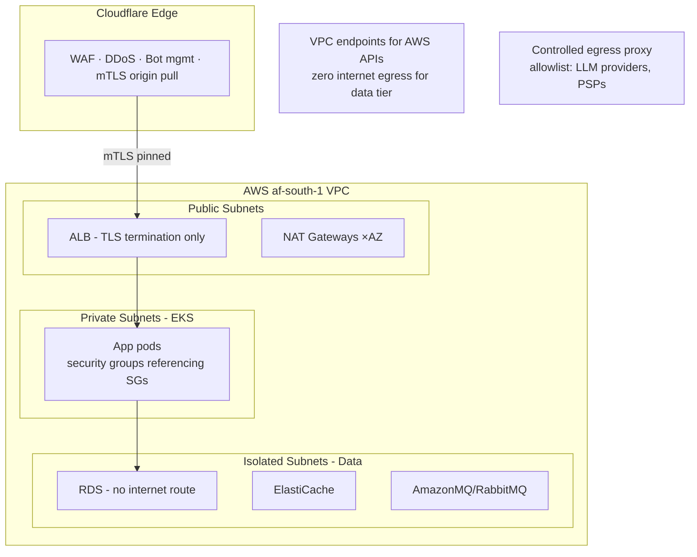
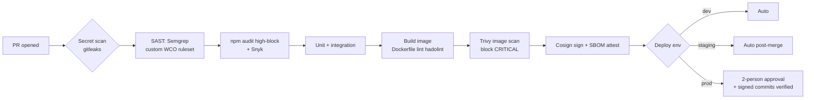

# WCO Security Plan

## Security Philosophy

**Zero-trust, least-privilege, defense-in-depth.** We handle merchants' livelihoods — payment flows, customer data, business conversations. A breach is existential. Security is a product feature, not a checklist.

Compliance targets: **NDPR (Nigeria)**, **Ghana DPA**, **Kenya DPA 2019**, **GDPR** (EU customers), **PCI-DSS SAQ-A** scope via tokenized payments.

---

## 1. Authentication Architecture

### 1.1 Identity Models

| Actor | Method | Session | MFA |
|-------|--------|---------|-----|
| Merchant (web/mobile) | Phone OTP + password optional | JWT access 15m + refresh 7d rotating | SMS/WhatsApp OTP step-up for sensitive ops |
| Customer (WhatsApp) | WhatsApp number ownership (inherent) | Conversation-scoped context, no accounts | n/a |
| Admin/staff | Email + password + TOTP enforced | JWT 15m + device binding | Mandatory TOTP |
| API consumers (3rd-party) | API keys `wco_live_{32B}` | Key rotation 90d, IP allowlist | HMAC request signing |
| Service-to-service | mTLS via service mesh + SPIFFE IDs | Short-lived certs | n/a |

### 1.2 Token Design

```json
{
  "sub": "usr_01H...",
  "storeId": "str_01H...",
  "role": "owner",
  "permissions": ["orders:read", "orders:write", "*"],
  "jti": "unique-token-id",
  "iat": 1700000000,
  "exp": 1700000900,
  "iss": "wco",
  "aud": "wco-api"
}
```

- **Access tokens**: 15min, stateless verification, `kid` header for key rotation
- **Refresh tokens**: 7d, stored hashed in PG, **rotation on every use with reuse detection** → reuse = family revoked = forced re-login + security event logged
- **Denylist**: Redis SET of revoked `jti`s checked on sensitive endpoints only (perf)
- Keys: RS256, rotated every 90d via JWKS endpoint; private keys in AWS Secrets Manager

### 1.3 Password & OTP Policy

- Argon2id (memory 64MB, iterations 3) — bcrypt fallback for legacy
- Breach check via k-anonymity HIBP API
- OTP: 6-digit, 10-min expiry, 5 attempts max then 30-min lockout, constant-time comparison
- Rate limits per phone number AND per IP AND global (SMS-pumping attack defense)
- SIM-swap heuristic: flag if OTP requested from new device geo <24h after port

---

## 2. Authorization — RBAC + Resource Scoping

```typescript
// Role hierarchy with permission matrix
type Permission = `${Resource}:${Action}`;
// Resources: stores, products, orders, customers, payments,
//            conversations, analytics, team, settings, api_keys
// Actions:   create, read, update, delete, export, admin

const ROLE_PERMISSIONS = {
  owner:      () => ['*:*'],
  manager:    () => ['*:create','*:read','*:update', 'team:read'],
  staff:      () => ['orders:create','orders:read','orders:update',
                     'products:read','products:update',
                     'conversations:read','conversations:write'],
  viewer:     () => ['*:read'], // analytics-only role
} as const;
```

**Defense-in-depth layers (all four must pass):**
1. **Guard**: JWT valid? Role has permission?
2. **Service**: Does this resource belong to caller's tenant? (`order.storeId === ctx.storeId`) — never trust client-supplied tenant IDs
3. **Prisma middleware**: Auto-inject `where storeId` on every query [belt]
4. **Postgres RLS**: `USING (store_id = current_setting('app.store_id')::uuid)` [suspenders]

**Critical invariant:** IDOR impossible by construction — tenant scoping applied below the application layer.

---

## 3. Data Protection

### 3.1 Encryption

| Layer | Standard | Implementation |
|-------|----------|----------------|
| In transit (external) | TLS 1.3, HSTS preload, certificate pinning (mobile) | Cloudflare + ALB |
| In transit (internal) | mTLS everywhere on mesh | Istio/Linkerd |
| At rest (storage) | AES-256-GCM | RDS/EBS/S3 KMS CMKs |
| At rest (field-level) | Envelope encryption | PII columns: phone, address, bank details |
| Backups | AES-256, cross-region, separate KMS key | Snapshot copies |
| Secrets at rest | AWS Secrets Manager + KMS auto-rotation | Never in env files in prod |

Field-level encryption design:
```
plaintext ──► DEK (per-record, random) ──► ciphertext + IV + tag
DEK ──► wrapped by KMS CMK ──► stored alongside record
Cache: plaintext NEVER cached for PII-Critical class fields
Searchable encryption: deterministic encryption for exact-match (phone lookup), 
blind index (HMAC-SHA256) for equality queries
```

### 3.2 PII Handling Rules

```typescript
// Central policy engine — enforced, not advisory
export const DATA_CLASSES = {
  PHONE:    { encrypt: true, log: 'mask', export: 'consent-required' },
  ADDRESS:  { encrypt: true, log: 'omit', export: 'consent-required' },
  PAYMENT_TOKEN: { encrypt: true, log: 'never', export: 'never' }, // PSP tokenized
  MESSAGE_BODY:  { encrypt: false, log: 'sampled', retentionDays: 730 },
};

// Logger redaction interceptor — automatic, tested
redactPatterns = [
  /(\+?234|0)[789]\d{9}/g,        // NG phones
  /\b\d{10,16}\b/,                 // card-shaped numbers
  /sk_[a-z]+_[A-Za-z0-9]{20,}/g,  // secret keys  
];
```

### 3.3 Payment Security (PCI scope minimization)

- **SAQ-A scope**: Card data never touches WCO servers — Paystack/Flutterwave hosted fields & payment links only
- Webhook signature verification mandatory before parsing body (constant-time compare)
- Idempotency keys on all money-mutation endpoints; replay window enforcement
- Reconciliation job daily: internal ledger vs PSP settlement report, variance >0.01% pages finance
- Internal ledger pattern: every balance change is an immutable ledger entry (append-only), balance derived — no mutable balance column to corrupt

---

## 4. Application Security Controls

### 4.1 Input/Output Safety

| Threat | Control |
|--------|---------|
| SQL injection | Prisma parameterized queries; raw-SQL lint rule requires `$executeRaw` review label |
| XSS | React auto-escaping; no `dangerouslySetInnerHTML` without sanitization + review; CSP strict |
| CSRF | SameSite=Strict cookies for web session; double-submit token for legacy paths |
| SSRF | URL allowlist for merchant-provided webhooks/images; DNS rebinding protection; no redirects followed |
| Path traversal | S3 keys UUID-generated server-side; filename metadata only |
| Prototype pollution | `Object.create(null)` for parsed JSON stores; ajv strict schemas |
| Mass assignment | DTO whitelisting (`whitelist: true, forbidNonWhitelisted: true`) |
| XXE | No XML processing anywhere (JSON-only APIs) |
| Zip bombs / CSV injection | Upload size caps, decompression bombs guard, formula-injection strip on CSV export |

### 4.2 Rate Limiting Matrix

| Endpoint class | Limit | Window | Enforcement point |
|----------------|-------|--------|-------------------|
| Login/OTP | 5/IP + 5/phone | 15 min | Edge + app (dual) |
| Registration | 3/IP/day | 24h | Edge |
| AI message processing | Per-merchant plan quota | Daily | Queue admission |
| Payment link creation | 100/merchant/hour | 1h | App |
| Public catalog reads | CDN shielded | — | Cloudflare |
| Webhooks inbound | Provider IP allowlist where available | — | Edge |
| Export/report generation | 5/merchant/day | 24h | App + queue |

Headers: standard `RateLimit-*`; 429 includes `Retry-After`.

### 4.3 Security Headers (enforced via Helmet + Cloudflare)

```
Content-Security-Policy: default-src 'self'; script-src 'self' 'nonce-{r}';
  frame-ancestors 'none'; object-src 'none'; base-uri 'none'
Strict-Transport-Security: max-age=63072000; includeSubDomains; preload
X-Content-Type-Options: nosniff
Referrer-Policy: strict-origin-when-cross-origin
Permissions-Policy: camera=(), microphone=(), geolocation=(self)
Cross-Origin-Opener-Policy: same-origin
Cross-Origin-Embedder-Policy: require-corp
```

CSP violation reports → Sentry; alerting on spikes (XSS attempt signal).

### 4.4 Dependency & Supply Chain

- Lockfiles committed; `npm ci` only in CI
- GitHub Dependabot (weekly PRs) + `npm audit --audit-level=high` gate in CI
- Snyk container scanning on every image build; block criticals
- SBOM generated per release (Syft) + attestation (cosign); verify at deploy admission (Kyverno)
- Internal packages published from monorepo via changesets — no `latest` tags
- Third-party scripts on frontend: allowlisted domains only in CSP; no inline analytics snippets

---

## 5. Infrastructure Security

### 5.1 Network Topology



Rules:
- Data tier: **no internet route, no public IPs, ever**
- All AWS API calls via VPC endpoints
- Egress proxy allowlist (LLMs, PSPs, logistics) — new destinations require security review ticket
- Security-group chaining (SG→SG references), zero `0.0.0.0/0` ingress outside edge

### 5.2 Kubernetes Hardening

```yaml
# Enforced by Kyverno cluster policies (deny on violation):
- runAsNonRoot: true; runAsUser > 10000
- readOnlyRootFilesystem: true; emptyDir for /tmp only
- allowPrivilegeEscalation: false; ALL capabilities dropped
- seccompProfile: RuntimeDefault
- resource requests+limits mandatory
- image registries: ECR only, cosign signature required  
- serviceAccountToken: automountServiceAccountToken: false (unless IRSA needed)
- NetworkPolicy default-deny ingress+egress per namespace; explicit allows only
```

- RBAC: deployers get namespace-scoped roles; nobody has cluster-admin in prod except break-glass (audited, time-boxed, PagerDuty-notified)
- etcd encryption enabled with KMS
- Pod Security Standards: `restricted` profile enforced

### 5.3 Secrets Management

```
Developer laptop ←(SSO, 8h cert)← AWS Secrets Manager
     │                                    ▲
     └── .env.local gitignored, gitleaks pre-commit
                                          │
K8s pods ← External Secrets Operator ← Secrets Manager (IRSA-scoped)
Rotation: DB creds 30d (via RDS managed rotation),
          PSP keys 90d, JWT signing 90d, API keys user-triggered
Emergency rotation: single command `wco-cli secrets rotate --scope=all` (rehearsed quarterly)
```

### 5.4 CI/CD Pipeline Security Gates



Additional: branch protection (signed commits, linear history), CODEOWNERS routing security-sensitive paths (`packages/payments/**`, `infra/security/**` → security team review), ephemeral CI environments with scoped OIDC credentials (no long-lived cloud keys in CI, ever).

---

## 6. Fraud & Abuse Prevention

| Vector | Detection | Response |
|--------|-----------|----------|
| Fake merchant signups | Phone/email reputation, velocity checks, behavioral signals | Manual KYB review queue for payout-enabling actions |
| WhatsApp spam relay | Message volume anomaly vs merchant baseline, template abuse patterns | Throttle → warn → suspend; human review |
| Chargeback fraud rings | Cross-merchant pattern analysis (shared addresses/devices) | PSP blocklists + account holds |
| Promo/discount abuse | Per-customer redemption caps, device fingerprinting | Auto-expire abusive codes |
| API scraping | Behavioral bot detection (Cloudflare Bot Management) | Progressive challenges |
| Insider threat | Full audit trail, least privilege, quarterly access recertification, no prod data access without ticket-linked justification | Immutable audit → SIEM correlation |

Merchant payout fraud specifically: payouts locked behind KYB tier system (Tier 1: ₦50K/day limit → Tier 3 verified: unlimited), velocity monitoring, ML risk score on payout requests, manual review above threshold.

---

## 7. Logging, Monitoring & Incident Response

### 7.1 Audit Trail (immutable)

Every sensitive action → append-only audit log (separate DB + S3 Object Lock):

```
WHO (actor id, IP, device, UA) 
WHAT (action, resource, before/after diff hash)
WHEN (NTP-synced timestamp, monotonic sequence)
WHY (request ID, linked ticket if admin action)
```

Monitored in real-time: permission escalation, bulk exports, payout changes, webhook secret views, admin impersonation (requires reason + expires in 60min, banner shown to merchant).

### 7.2 Detection Engineering (SIEM rules, Datadog Security Monitoring)

| Signal | Threshold | Severity |
|--------|-----------|----------|
| Auth failures per account | >10 in 10min | Warning → CAPTCHA |
| Credential stuffing pattern | Distributed low-and-slow detected | High |
| Webhook signature failure spike | >1%/provider/5min | Critical (key compromise?) |
| Unusual data export volume | >P99 merchant baseline | High |
| Privilege change outside change window | Any | Critical page |
| RLS bypass attempt log | Any | Critical page |

### 7.3 Incident Response

**Severity ladder:** SEV1 (data breach/total outage) → SEV4 (minor).

```
Detect (alert/signal/report) ──≤5min──► Acknowledge (on-call)
  ──► Triage & declare severity ──► Mitigate (contain first, forensics second)
  ──► Eradicate ──► Recover ──► Postmortem (blameless, within 72h)
```

- On-call rota: primary + secondary, 24/7, PagerDuty escalation 5→15min
- SEV1 comms: status page ≤15min, affected-merchant notifications per NDPR 72h breach notification duty (we commit to 24h internally)
- War room: dedicated Slack channel auto-created, scribe assigned
- Forensics readiness: EKS audit logs shipped to immutable store; memory captures tooling documented
- Quarterly tabletop exercises with scenarios (insider exfil, PSP key leak, ransomware on backup bucket)

---

## 8. Compliance Implementation

### 8.1 NDPR / GDPR / African DPAs — Unified Control Set

| Requirement | Implementation |
|-------------|----------------|
| Lawful basis mapping | Consent (marketing), Contract (core service), Legitimate interest (fraud) — recorded per data flow |
| Privacy by design | DPIA template mandatory for new features touching personal data; privacy review gate in PR template |
| Data subject rights | Self-service portal: export (Article 20 ZIP), erasure (Article 17 cascade — see data-flow doc), rectification; SLA 30 days, typical <24h |
| Consent management | Granular consent records with timestamp+version; marketing requires explicit opt-in (pre-checked boxes banned) |
| Data residency | Primary storage af-south-1; EU merchant data optionally pinned eu-west-1; transfers under SCCs documented |
| Processor agreements | DPAs signed with all processors (Meta, Twilio, PSPs, Anthropic, OpenAI — zero-data-retention endpoints negotiated for AI providers) |
| Breach notification | Automated workflow: detect → assess → notify NITDA/authority ≤72h + affected subjects without undue delay |
| Records of processing | RoPA maintained in `docs/security/ropa.md`, reviewed quarterly |
| Minors | Age signal checks for certain categories; parental consent flows documented |

### 8.2 PCI-DSS SAQ-A Maintenance

Annual SAQ-A attestation; quarterly ASV scans on public-facing infrastructure; PSP responsibility matrices documented; annual penetration test (external firm) covering payment paths.

### 8.3 Security Certifications Roadmap

```
Year 1: SOC 2 Type I → Year 2: SOC 2 Type II + ISO 27001 Stage 1 → Year 3: ISO 27001 certified
Continuous: control mapping maintained in Vanta/Drata-style automation from day one
```

---

## 9. Secure Development Lifecycle

| Phase | Control |
|-------|---------|
| Design | Threat modeling (STRIDE) for features handling money/PII; ADR security section required |
| Code | Security champions per squad; Semgrep custom rules for our anti-patterns; pair review for crypto/auth code |
| Test | Security unit tests (authz matrix fuzzing, injection payloads in fixtures); DAST (ZAP baseline) nightly against staging |
| Release | Signed releases; provenance attestation; canary + auto-rollback on security anomaly signals |
| Operate | Bug bounty (launch at scale: public program via YesWeHack, starting NG-focused); vulnerability disclosure policy (security.txt) |
| Deprecate | Dependency EOL tracking; secret rotation on team member offboarding checklist (automated) |

## 10. Security Metrics (tracked weekly, exec-visible)

- MTTR critical vulnerabilities: target <48h
- % services with current threat model: 100%
- Phishing simulation click rate: <5%
- Secrets committed to git: 0 (hard gate)
- Overdue access reviews: 0
- Backup restore test success: 100% quarterly
- RLS coverage of tenant tables: 100%
