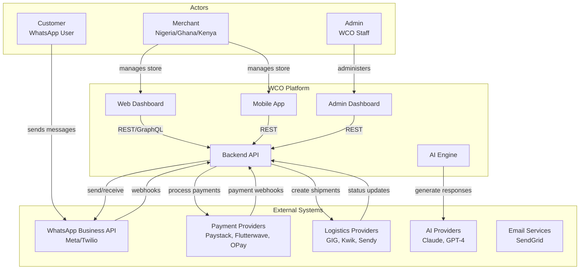
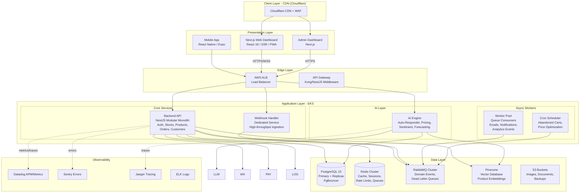
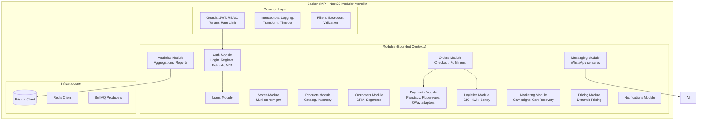
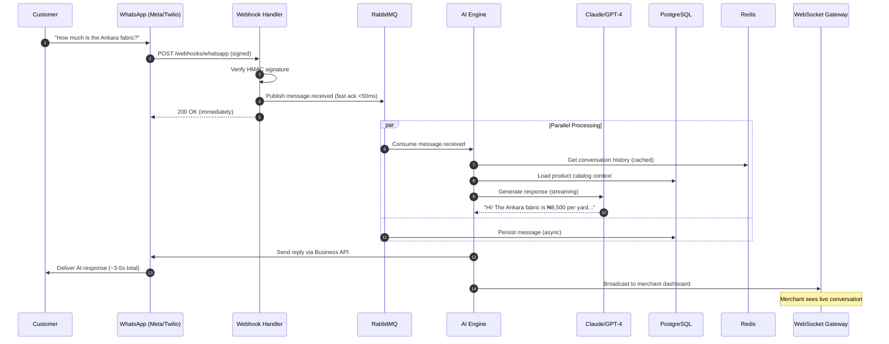
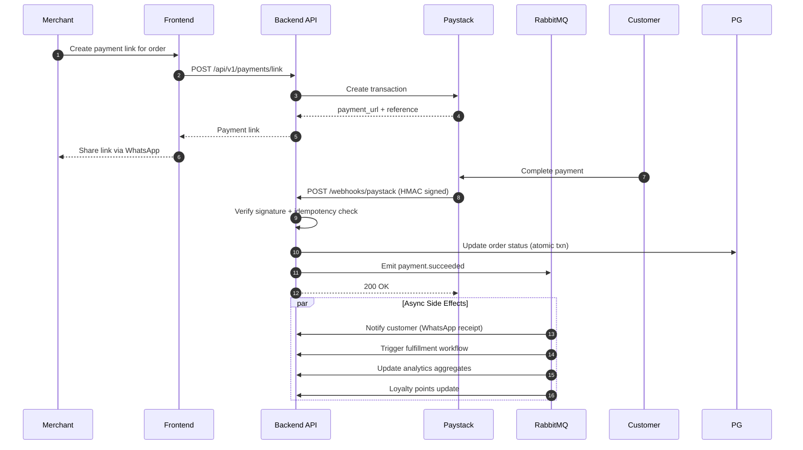
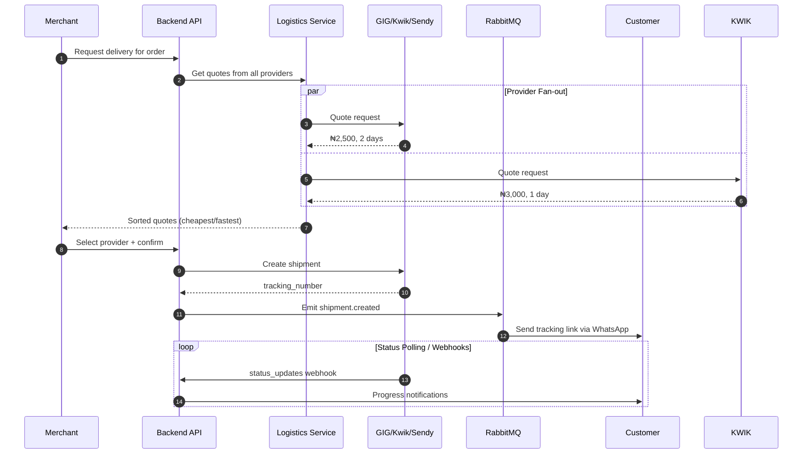
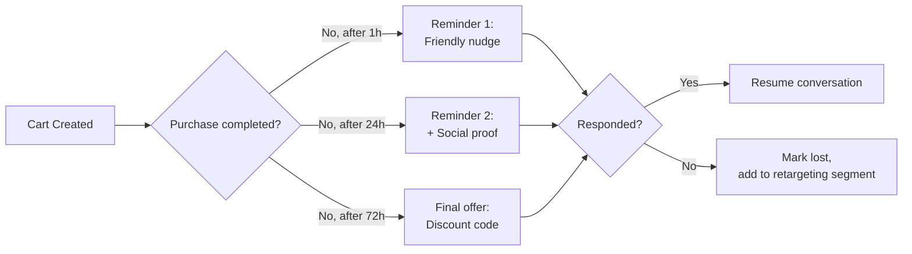

# WCO System Architecture

## Executive Summary

WhatsApp Commerce OS (WCO) is a cloud-native, event-driven SaaS platform built on a modular monolith backend with strategically extracted microservices. The architecture is designed for 1M+ merchants, 100K+ requests/second, and sub-5-second AI response times while maintaining 99.95% availability.

## Architecture Principles

1. **Modular Monolith First**: Start simple, extract services when scale demands it
2. **Event-Driven**: Async processing via domain events (RabbitMQ)
3. **API-First**: OpenAPI contracts before implementation
4. **Multi-Tenancy**: Row-level isolation with tenant context propagation
5. **Zero-Trust Security**: Every request authenticated & authorized
6. **Observability-First**: Distributed tracing, metrics, structured logs
7. **Failure Isolation**: Circuit breakers, bulkheads, graceful degradation

---

## 1. High-Level System Context Diagram

Shows WCO in relation to external actors and systems:



---

## 2. Container Diagram (C4 Level 2)

Detailed view of the containers within the WCO platform:



---

## 3. Component Diagram — Backend API (C4 Level 3)



---

## 4. Key Data Flows

### 4.1 Customer Message → AI Auto-Response (< 5s)

The flagship flow. Customer sends WhatsApp message; AI replies in seconds.



### 4.2 Payment Flow (Paystack example)



### 4.3 Delivery Arrangement Flow



### 4.4 Abandoned Cart Recovery



---

## 5. Multi-Tenancy Model

WCO uses **shared database, shared schema** with row-level tenant isolation:

```
┌─────────────────────────────────────────────────┐
│                  PostgreSQL                      │
│  ┌───────────────────────────────────────────┐  │
│  │              Single Schema                 │  │
│  │                                            │  │
│  │  stores ──┬── products                     │  │
│  │           ├── orders                        │  │
│  │           ├── customers                     │  │
│  │           └── conversations                 │  │
│  │                                            │  │
│  │  Every row scoped by store_id/user_id      │  │
│  │  Enforced by:                              │  │
│  │   • Prisma middleware (app layer)          │  │
│  │   • Tenant guard (request layer)           │  │
│  │   • Postgres RLS (defense-in-depth)        │  │
│  └───────────────────────────────────────────┘  │
└─────────────────────────────────────────────────┘
```

**Why this model?**
- 1M+ tenants × small data each = pooling efficiency
- Cheapest option at startup scale (single DB)
- Migration path to schema-per-tenant or DB-per-tenant for enterprise customers documented in [ADR-007]

**Tenant context propagation:**
```
Request → JWT → { userId, storeId } → AsyncLocalStorage → Prisma middleware auto-filters
```

---

## 6. Scalability Design Decisions

| Bottleneck Risk | Mitigation |
|-----------------|------------|
| WhatsApp webhook bursts | Dedicated webhook-handler service, queue-based load leveling |
| AI latency spikes | Response streaming, prompt caching, fallback models, semantic cache |
| DB connection exhaustion | PgBouncer (transaction mode), read replicas |
| Hot products/stores | Redis cache-aside pattern, CDN for images |
| Analytics slowing OLTP | Separate ClickHouse cluster, async aggregation |
| Queue backlog | Horizontal worker autoscaling (KEDA), DLQ + replay tooling |
| Traffic spikes (Black Friday) | HPA + predictive scaling, pre-warmed capacity |

## 7. Availability & Failure Modes

| Failure | Impact | Mitigation | Recovery |
|---------|--------|------------|----------|
| Claude API down | No AI replies | Failover to GPT-4 → template fallback | Auto-retry w/ backoff |
| Paystack down | Payment failures | Circuit breaker, retry queue, alternate PSP | Automatic provider failover |
| Primary DB down | Writes fail | Promote replica (RDS multi-AZ, ~60s) | Automated failover |
| Redis down | Cache misses | Serve stale, degrade gracefully | Rebuild from source |
| RabbitMQ down | Delayed async work | Messages buffer in-memory, alerting | Mirror queues (quorum) |
| Region outage | Full outage | Route53 failover to secondary region | RTO: 15min, RPO: 5min |

**SLOs:**
- API availability: 99.95% monthly
- AI response p95: < 5s end-to-end
- Payment webhook processing: p99 < 30s
- Dashboard TTFB: p75 < 1.2s

## 8. Future Evolution Path

```
Phase 1 (Now):     Modular monolith + extracted AI/webhook services
Phase 2 (10K merchants): Extract Orders/Payments into separate deployables
Phase 3 (100K merchants): Event sourcing for order lifecycle, CQRS reads
Phase 4 (1M merchants): Cell-based architecture (regional cells), 
                         dedicated DB clusters for enterprise tier
```
