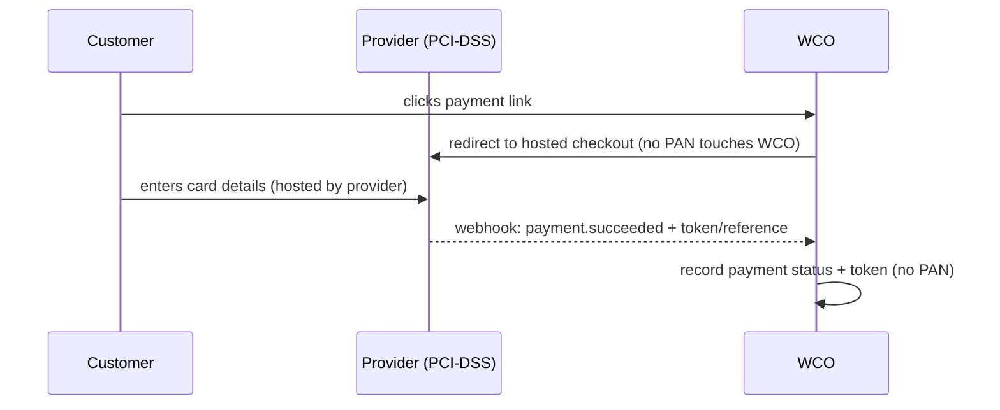

# PCI DSS Compliance

How WCO manages **Payment Card Industry Data Security Standard (PCI DSS)** obligations and minimizes its cardholder-data scope.

## 1. Cardholder data scope

WCO **does not store full card numbers, PINs, or CVV**. Card payments are processed by **PCI-DSS-compliant payment providers** (Paystack, Flutterwave, OPay) via hosted/tokenized checkout. This keeps WCO's cardholder-data scope to a **minimum** (SAQ-A-type model for our endpoints).

| Data | Stored by WCO? |
|---|---|
| Full PAN / card number | ❌ No |
| CVV / PIN / track data | ❌ No (prohibited to store) |
| Tokenized reference / payment status | ✅ Yes (non-sensitive token + status) |

## 2. How payments work (tokenized, no PAN at WCO)

## 3. Controls WCO maintains

- **Encryption at rest/transit** — [Data encryption](../security/03-data-encryption.md).
- **Access control / least privilege** — [Authentication & authorization](../security/02-authentication-authorization.md).
- **Secure software development** — validation, injection/XSS prevention ([API security](../api/security.md)).
- **Vulnerability management** — SAST/DAST/dependency scans ([Vulnerability management](../security/04-vulnerability-management.md)).
- **Audit logging** of financial operations — [Audit trail](./06-audit-trail.md).
- **Monitoring & incident response** — [Security monitoring](../security/06-security-monitoring.md) + [Security incident playbook](../playbooks/06-security-incident-playbook.md).

## 4. Responsibilities of merchants (our ecosystem)
- WCO does not give merchants access to customer card numbers; merchants never handle full card data through WCO.
- Merchants must not ask for or record card details in WhatsApp chats — we advise them to use payment links.
- Any card data a merchant receives on their own channels is outside WCO's scope and is the merchant's responsibility under their own PCI obligations.

## 5. Validation & attestation
- WCO validates its minimal-scope posture (e.g., SAQ/attestation) in coordination with its payment providers.
- Providers' compliance is evidenced via their own attestations; we review on onboarding and periodically ([Compliance playbook](../playbooks/07-compliance-playbook.md#7-vendor--processor-management)).

## 6. If card data is suspected exposed
- This is a **high-severity security incident** → [Security incident playbook](../playbooks/06-security-incident-playbook.md), with PCI-required notification and involvement of the provider.

## Related
- [Security documentation](../security/README.md)
- [Compliance runbook](../runbooks/compliance.md)
