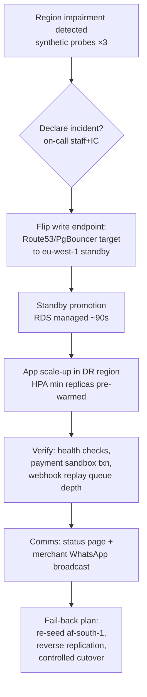

# WCO Backup & Disaster Recovery

## 1. Objectives

| Metric | Target | Achieved by |
|---|---|---|
| RPO (data loss tolerance) | **≤ 5 min** committed transactions | continuous WAL archiving |
| RPO (regional) | ≤ 15 min | cross-region WAL + snapshot shipping |
| RTO (single AZ) | < 2 min, automatic | Multi-AZ failover |
| RTO (region loss) | < 60 min | promote DR replica + repoint PgBouncer |
| RTO (logical corruption) | < 4 h | PITR clone to new instance, surgical extract |

## 2. Backup strategy

### 2.1 Continuous (primary defense)
* **WAL streaming to S3** via pgBackRest/WAL-G: 16MB segments archived as they
  complete; async replica acts as warm standby.
* **Snapshots:** hourly incremental (retention 48h), daily full (35d),
  weekly → S3 Glacier (12mo compliance tier).
* All artifacts KMS-encrypted with the backup CMK (separate from live-data key
  — blast-radius isolation); cross-region copies use the DR-region key.

### 2.2 Logical dumps (defense against logical corruption)
Nightly `pg_dump --format=custom` per schema domain (identity/billing vs
commerce vs messaging) to S3 IA. Custom format enables selective table restore
— you rarely need the whole universe to recover one dropped table.

### 2.3 ClickHouse / Elasticsearch / Redis
* ClickHouse: `BACKUP TABLE` nightly to S3 + Kafka/RabbitMQ replay window for
  CDC gaps; rebuildable from Postgres CDC at any time (source-of-truth rule).
* Elasticsearch: derived store — no backups; recovery = reindex from PG.
* Redis: AOF everysec on persistence nodes; sessions are disposable by design.

## 3. Point-in-time recovery runbook

```bash
# 1. Clone to a NEW instance at target time (never restore in place)
aws rds restore-db-instance-to-point-in-time \
  --source-db-instance-identifier wco-prod-pg \
  --target-db-instance-identifier wco-prod-pg-pitr-$(date +%s) \
  --restore-time 2026-08-22T09:14:00Z --db-instance-class db.r6g.4xlarge

# 2. Verify: row counts, max(createdAt), checksum of known-good aggregates
psql "$PITR_URL" -c "SELECT count(*), max(\"createdAt\") FROM orders WHERE \"createdAt\"::date=CURRENT_DATE"

# 3. Surgical extract (example: bad migration nuked products)
pg_dump "$PITR_URL" -t products -t product_variants -Fc -f salvage.dump

# 4. Restore into prod within a transaction; outbox events re-emit deltas
pg_restore "$PROD_URL" --table=products --table=product_variants salvage.dump
```

Guardrail: prod restores of append-only tables (audit_logs, payments) require
two-person approval — those tables' history is evidence.

## 4. Disaster recovery plan



* DR region (eu-west-1) runs an async replica + pre-provisioned app capacity at
  30% of primary; KEDA scales it during declaration.
* Quarterly game-day executes steps C→F end-to-end in staging AND a partial
  production traffic test (5% read shadow).
* Annual Black-Friday simulation replays the largest historical day ×25.

## 5. Crypto-shredding for backups (GDPR erasure completeness)

Backups cannot be row-edited, so erasure completeness is cryptographic:
per-tenant data keys wrap tenant-scoped columns (`payment_methods.*`,
`messages.body` archive files). DSAR execution destroys that tenant's data key;
any future restore renders the erased merchant's ciphertext permanently
undecryptable while other tenants remain intact. Key-destruction events are
themselves audit-logged.

## 6. Verification drills (a backup is a hypothesis until restored)

| Frequency | Drill | Pass criteria |
|---|---|---|
| Weekly (automated) | Latest snapshot → ephemeral instance → smoke SQL suite | all queries green <10min |
| Monthly | PITR to random T-72h timestamp | checksum match on sampled aggregates |
| Quarterly | Full region-failover tabletop + staging execution | RTO measured & logged vs targets |
| Annually | Restore-from-Glacier of one archival partition | Athena-queryable, row counts exact |

Every drill produces an incident-style doc; failed drills create P1 action
items, not meeting notes.

## 7. Runbook quick reference

| Scenario | First action | Doc section |
|---|---|---|
| Replica lag >30s | kill top analytics query, route to CH | performance.md §6 |
| Primary unreachable | verify Multi-AZ failover triggered; check PgBouncer pool errors | §4 |
| Bad deploy corrupted rows | freeze writers (feature flag), PITR clone, surgical extract | §3 |
| Ransomware/wipe suspicion | revoke IAM immediately, isolate snapshots, engage security IC | security-compliance.md §6 |
| Accidental table drop | stop migrations pipeline, pg_dump custom restore of that table | §2.2 |
