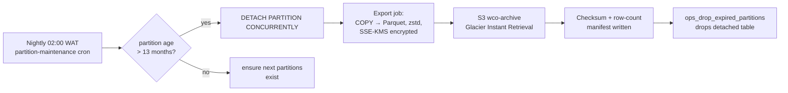

# WCO Data Lifecycle — Retention, Archival & Erasure

## 1. Retention matrix

| Data | Hot (PG) | Warm (archive) | Cold/deleted | Legal driver |
|---|---|---|---|---|
| Messages | 90 days in partitions | 13 months → S3 Parquet (gzip, partitioned by store/month) | Purged after erasure request | NDPR data-minimization; WhatsApp policy |
| analytics_events | 30 days PG / rest in ClickHouse | 25 months Parquet | aggregate-only afterwards | Internal analytics |
| audit_logs | 6 months | 24 months (compliance floor) | then deleted | Financial-record retention |
| orders + items + payments | Indefinite while merchant active | S3 Parquet mirror monthly | Anonymized on merchant off-boarding + 90d | Tax/accounting (NG: 6y) — we keep aggregates, anonymize PII at 24mo |
| deliveries | 24 months | with order archive | — | Dispute windows |
| refresh_tokens | until expiry +7d sweep | none | — | Security hygiene |
| outbox_events (processed) | 30 days | none | swept nightly | Operational only |
| subscriptions/invoices | life of account | 7 years post-cancellation | — | Billing/tax law |
| customers PII | life of consent | — | Erased within 72h of verified DSAR | GDPR Art.17 / NDPR §3 |

## 2. Archival pipeline

Guarantees:
* **Nothing is dropped before the manifest verifies** row counts + `md5` per
  file; export is idempotent and re-runnable.
* Archive layout: `s3://wco-archive/{table}/{YYYY}/{MM}/{shard}.parquet` —
  queryable via Athena for support investigations without touching OLTP.
* PII columns (`waPhone`, `recipientPhone`, `accountNumberEnc`) are tokenized
  during export; archives are analysis-safe by construction.

## 3. Cleanup jobs (all idempotent, all alert on zero-progress)

| Job | Schedule | SQL core |
|---|---|---|
| Token sweeper | hourly | `DELETE FROM refresh_tokens WHERE "expiresAt" < now()-interval '7 days'` (indexed) |
| Outbox sweeper | daily | `DELETE FROM outbox_events WHERE "processedAt" IS NOT NULL AND "createdAt" < now()-interval '30 days'` |
| Expired suggestion expiry | daily | `UPDATE price_suggestions SET status='EXPIRED' WHERE status='PENDING' AND "expiresAt" < now()` |
| Soft-product hard-delete | weekly | products `deletedAt < now()-90d` AND no order_items FK → DELETE; else anonymize name/sku suffix `-REDACTED` |
| Orphan media sweep | weekly | diff S3 keys vs `products.images`/`messages.mediaUrl`; delete unreferenced >30d |
| Partition lifecycle | daily/weekly | see partitioning doc |
| Metrics re-rollup check | daily | compare `daily_store_metrics` vs source-of-truth query for yesterday; auto-heal ±ε |

Jobs run as KEDA CronScale workers writing to a `lifecycle` audit log entry per
run (rows scanned/affected) — silent failures page the on-call.

## 4. GDPR / NDPR erasure (DSAR) flows

**Right-to-erasure SLA: 72 hours end-to-end**, executed by
`dsar-erasure` worker:

1. **Verify** request (control message to the customer's WhatsApp + email).
2. **Export** everything we hold about the requester (JSON bundle, signed URL,
   valid 7 days) — right to portability satisfied simultaneously.
3. **Erase/anonymize** inside one logical transaction per domain:
   * `customers` row → tombstone: name/email/notes nulled, `waPhone` →
     HMAC placeholder, tags/segments cleared, marketingOptIn=false.
     Row is NOT deleted: orders/payments RESTRICT integrity + tax law require
     financial continuity.
   * `conversations` + `messages`: body/mediaUrl nulled for this customer's
     threads; thread rows kept as skeletons (order linkage).
   * `deliveries.recipientName/recipientPhone`, `campaign_messages` payloads.
   * Elasticsearch: purge-by-query on `customerId`, then alias refresh.
   * Redis: delete cached entities (`{store}:cust:*`), sessions die naturally.
   * Backups: covered by crypto-shredding — see backup-recovery.md §5.
4. **Certificate** stored in `audit_logs` (action=`dsar.erased`) listing every
   touched table + row counts.

Legal-hold override: accounts under active fraud/dispute investigation freeze
the flow (flagged in merchants.settings), reviewed every 30 days.

## 5. Merchant off-boarding

1. Subscription → CANCELLED at period end; grace read-only window 30d.
2. Day 31: stores CASCADE-wipe catalog/customers/conversations; payments/
   deliveries/orders retained but merchant-scoped PII anonymized;
   `merchants` row tombstoned (`settings.offboardedAt`).
3. Webhook secrets + API tokens revoked; ES indices' tenant docs purged.

## 6. What we deliberately never do

* No soft deletes on money tables (they must stay RESTRICT-clean).
* No archival of `subscription_plans`/plans history — tiny, forever useful.
* No manual SQL deletions outside the lifecycle worker — every destructive path
  goes through reviewed, audited code.
