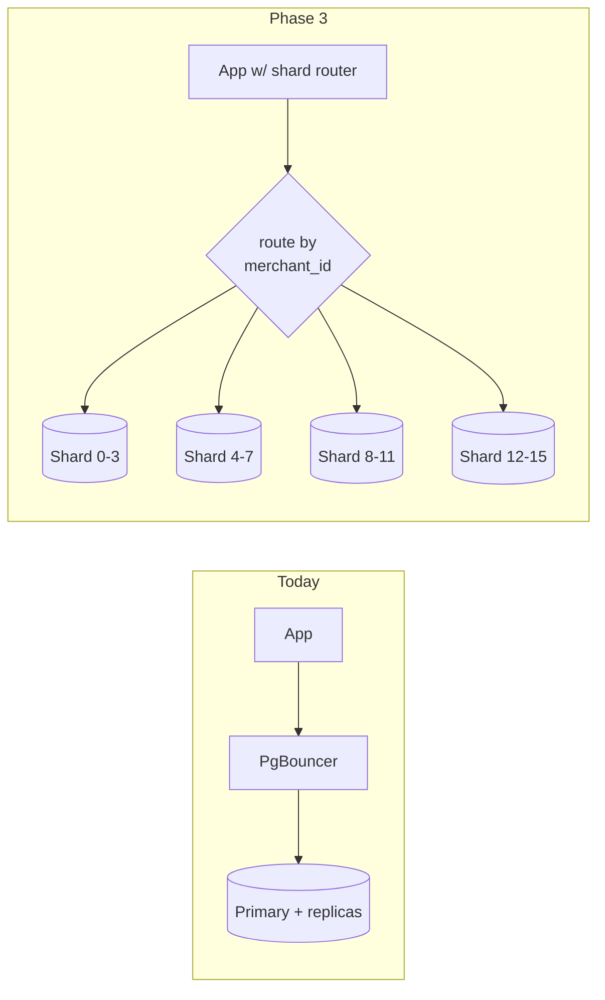

# WCO Partitioning & Sharding Strategy

## 1. Why partition before you shard

Partitioning (single node, many files) solves retention + scan pruning.
Sharding (many nodes) solves CPU/IO ceilings. We partition from day one and
shard only when the vertical+replica ceiling is provably reached — each shard
boundary adds operational surface (cross-shard transactions, rebalancing).

Targets that trigger each phase:

| Phase | Trigger | Action |
|---|---|---|
| 0 — now | Launch | Vanilla tables in dev; prod runs `post-migrate.sql` |
| 1 — partitions | >50M rows on messages/events | Monthly RANGE partitions (automated) |
| 2 — functional split | chat writes saturate 60% sustained | conversations/messages → dedicated `chat-db` cluster |
| 3 — tenant sharding | >10TB or write IOPS ceiling | hash(merchantId) → 16 logical shards |

## 2. Partitioned tables (production layout)

Applied by `infra/db/postgres/post-migrate.sql` **after** `prisma migrate
deploy`. Dev databases stay vanilla so Prisma diffs remain clean.

| Table | Key | Interval | Retention |
|---|---|---|---|
| `messages` | RANGE (`createdAt`) | 1 month | detach at 13mo → archive → drop |
| `analytics_events` | RANGE (`occurredAt`) | 1 month (Timescale: 7-day chunks) | same |
| `audit_logs` | RANGE (`createdAt`) | 1 month | 24 months (compliance) |

### PostgreSQL constraints we engineered around

* **PK must include the partition key.** Parent PKs became `(id, "createdAt")`;
  a plain UNIQUE index on `id` keeps Prisma's `findUnique` semantics intact
  (documented drift contract in the script header).
* **Global uniqueness vs partition key.** `messages.waMessageId` can't be
  globally unique once time-partitioned (PG requires unique constraints to
  contain the partition key). Dedupe therefore happens in two layers:
  Redis `SET NX` guard at webhook ingest (authoritative), plus per-row best
  effort at DB. Documented trade-off; acceptable because provider retries
  arrive within seconds of the original.
* **Pruning proof:** `EXPLAIN` on thread queries shows `Subplans Removed: N`
  — old months never scanned.

### Automation

```sql
-- nightly (pg_cron or K8s CronJob):
SELECT ensure_monthly_partition('public.messages'::regclass,
       (date_trunc('month', now() AT TIME ZONE 'UTC') + INTERVAL '2 months')::date);
-- weekly:
SELECT ops_drop_expired_partitions('messages'::regclass, 13);
```

Partitions are pre-created 2 months ahead; a missing-partition insert fails
loudly (we prefer an alert over silently writing to a default catch-all).

### TimescaleDB option

When Timescale is enabled on prod RDS-compatible engine, `analytics_events`
converts to a hypertable (7-day chunks) with continuous aggregates feeding
`daily_store_metrics` in real time — replacing part of the cron rollup. The
conversion block is included in `post-migrate.sql` behind an extension check.

## 3. Sharding roadmap (Phase 3)

### Shard key decision

```
shard_id = hash(merchant_id) mod 16        -- logical shards
logical_shard → physical instance map kept in etcd/config-service
```

Why merchant, not store: billing consistency (subscriptions/payouts) lives at
merchant scope; a store never spans merchants anyway. Why not customer phone:
customers are store-local; global customer graph isn't a real access pattern.

### What changes



* **Routing layer:** NestJS interceptor resolves `merchantId → shard` from
  TenantContext before pool selection; PgBouncer instance per shard.
* **Invariants preserved:** every business row already carries `storeId`, and
  stores carry `merchantId` — no cross-shard FK exists in the schema today
  (verified: all FKs resolve within one tenant subtree). Platform-global tables
  (`subscription_plans`, `delivery_providers`, `outbox_events`) replicate to
  every shard read-write via logical replication from a config primary.
* **Cross-shard queries** (platform ops dashboards only) go through ClickHouse,
  which is fed by CDC per shard — OLTP never does fan-out MPP queries.
* **Resharding:** consistent-hash ring with 16→64 virtual buckets; online
  migration copies tenant subtrees with dual-write + read-shadow, validated by
  row-count/checksum jobs before cutover.

### Enterprise tier

Top-100 accounts get dedicated instances ("cell" isolation) — same schema, own
connection string, own PITR schedule. Isolation becomes a selling feature.

## 4. Capacity model behind the phases

| Table | Rows @1M merchants | Row bytes | Total |
|---|---|---|---|
| messages | ~3B/yr (100M/day peak-season avg 40M/day) | ~450B | ~1.4TB/yr pre-compression |
| analytics_events | ~5B/yr | ~180B | ~900GB/yr (columnar in CH after 30d) |
| orders + items | ~120M/yr | ~600B | ~75GB/yr — never needs sharding alone |
| everything else | — | — | <200GB |

Conclusion: only messaging/event streams justify partition→split→shard
escalation; commerce core scales comfortably on well-indexed verticals +
replicas for years.
