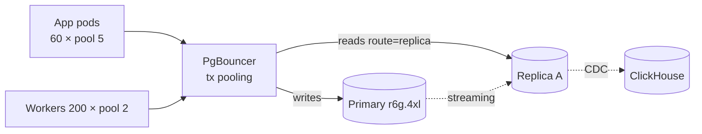

# WCO Database Performance & Optimization

## 1. Connection architecture



* **PgBouncer transaction mode**: ~20k client sockets collapse to ≤200 server
  connections. `server_reset_query = DISCARD ALL`; GUC tenant context set with
  `SET LOCAL` inside each transaction (pool-safe by construction).
* Pool sizing math: `connections ≈ cores × 2 + spindles` — r6g.4xl (16 vCPU)
  → 200 is deliberately above; headroom for analytics bursts, guarded by role
  statement_timeout.
* Prisma side: explicit pool per service class (API 5/pod, workers 2/pod);
  connection budget table lives in scalability-plan.md §2.5.

## 2. Read/write routing

| Workload | Route | Mechanism |
|---|---|---|
| Checkout/payment webhooks | Primary | Money writes never read stale state |
| Catalog/inbox lists | Replica A | Repository flag `readPreference: 'replica'` → PgBouncer read endpoint |
| Analytics/exports | Replica B → ClickHouse | Anything scanning >100k rows is banned from OLTP endpoints (pg_stat monitoring + pg_kill on violation) |
| Cursor pagination everywhere | both | Keyset (`WHERE (storeId,"createdAt") < ($1,$2)`) — OFFSET banned past page 3 |

Replica-lag guardrails: critical read-after-write paths use the primary;
dashboard endpoints accept ≤30s staleness; a `/health/lag` probe gates traffic
shifts during failover.

## 3. Query discipline

1. **No N+1** — Prisma `include`/`select` with dataloaders in GraphQL-ish
   resolvers; CI runs an N+1 detector on repository tests (query-count asserts).
2. **Indexes before code** — new query ⇒ EXPLAIN gate in PR template.
3. **Batch writes** — `createMany`, `updateMany`, COPY for >10k-row loads
   (`analytics_events` ingest path uses binary COPY via worker).
4. **Hot-path column budgets** — list endpoints select ≤12 columns; wide row
   fetches only on detail views.
5. **Locks** — all multi-statement money flows use
   `SELECT … FOR UPDATE SKIP LOCKED` job claims (outbox relay) or idempotent
   transition guards (`transitionIfInState`) instead of long transactions.

Worked example — order payment webhook:
```
BEGIN;
  SET LOCAL app.current_store_id='…';
  UPDATE orders SET status='PAID', "paidAt"=now()
    WHERE id=$1 AND "storeId"=$2 AND status='PENDING_PAYMENT';   -- guard: count=1?
  UPDATE payments SET status='SUCCEEDED', "paidAt"=now()
    WHERE "providerReference"=$3;                                -- unique ⇒ idempotent
  INSERT INTO outbox_events(...) VALUES ('order.paid'…);          -- ADR-002 atomic emit
COMMIT;
```
Two round-trips amortized over one transaction; replay-safe under any retry
storm because every step is a no-op on second run.

## 4. Caching strategy (Redis patterns)

| Pattern | Keys | TTL | Invalidation |
|---|---|---|---|
| Cache-aside entity | `{store}:prod:{id}`, `{store}:cat:list` | 300s | write-through delete on product mutations |
| AI config snapshot | `{store}:aicfg` | 60s | delete on settings change |
| Session envelope | `sess:{sessionId}` | 15m sliding | logout deletes; denylist `bl:{jti}` TTL=jwt exp |
| Rate limits | see redis doc (sliding windows via sorted sets) | window+grace | — |
| Semantic AI cache | Pinecone + `aicache:{store}:{hash}` | 24h | model/version bump flushes namespace |
| Token budgets | `tok:{merchant}:{yyyymmdd}` INCR | 48h | cron reset |
| Distributed locks | Redlock `lock:stock:{variantId}` | 10s | release-on-commit |
| Dashboard rollups | `metrics:{store}:today` | 60s | recomputed by metrics job |

Cache-aside contract (repository base class): read-through, delete-on-write,
never cache-per-user-only data under shared keys, stampede protection via
single-flight lock key. Hit-rate SLO ≥85% on catalog reads (Datadog monitor).

## 5. Server-side tuning baseline

| Setting | Value | Why |
|---|---|---|
| shared_buffers | 25% RAM | classic floor |
| effective_cache_size | 60% RAM | planner honesty |
| work_mem | 32MB (per-op) | sorts/hash on reporting queries; raised per-session only for exports |
| maintenance_work_mem | 1GB | autovacuum/index builds |
| max_wal_size | 20GB | absorbs batch-write bursts without checkpoint storms |
| autovacuum scale_factor | 0.05 on messages/orders/events | hot append tables vacuum early |
| logical replication | on | feeds ClickHouse/Elasticsearch via Debezium |
| random_page_cost | 1.1 | SSD reality |

## 6. Monitoring & alert thresholds

| Signal | Warn | Page |
|---|---|---|
| p99 API DB time | >80ms | >250ms |
| replica lag | >10s | >30s |
| longest transaction | >30s | >120s |
| dead tuples ratio (hot tables) | >10% | >20% |
| temp bytes written/min | >500MB | >2GB |
| cache miss ratio (buffers) | >15% sustained 15m | >30% |
| PgBouncer cl_waiting | >50 | >200 |

Weekly capacity review tracks the top-10 `pg_stat_statements` by
total_exec_time — anything fixable gets an index/query ticket, anything
analytical gets evicted to ClickHouse.
