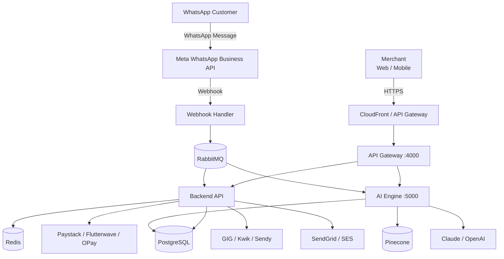
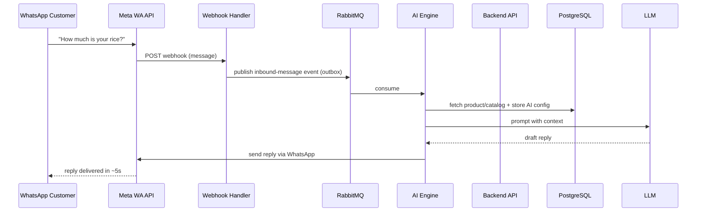

# Architecture Overview

> **Canonical, deep-dive architecture documents** live in [`docs/architecture/`](../architecture/README.md) and [`docs/database/`](../database/README.md). This page is the developer-facing summary: system components, data flow, and the conventions that matter when you write code.

## System context



## Services & ports (local dev)

| Service | App / Port | Tech | Responsibility |
|---|---|---|---|
| API Gateway | `apps/backend` :4000 | NestJS | Entry point, auth, rate limiting, RBAC |
| Backend API | `apps/backend` :4001 | NestJS | Core business logic |
| Webhook Handler | `apps/webhook-handler` :4002 | NestJS | Provider & inbound WhatsApp webhooks |
| AI Engine | `apps/ai-engine` :5000 | FastAPI/Python + NestJS adapters | Auto-reply, pricing, forecasting |
| Frontend | `apps/frontend` :3000 | Next.js 14 + Tailwind | Merchant dashboard |
| Admin Dashboard | `apps/admin-dashboard` :3001 | Next.js | Internal admin |
| Mobile | `apps/mobile` | React Native + Expo | iOS / Android app |

## Data stores

| Store | Role |
|---|---|
| PostgreSQL 15 | Primary transactional data (Prisma-managed schema) |
| Redis 7 | Sessions, caching, rate limiting, some queues |
| RabbitMQ 3.12 | Async job / event queue (outbox delivery) |
| Pinecone | Vector embeddings for the AI engine |
| AWS S3 | Object storage (product images, documents) |
| Elasticsearch | Full-text search + log aggregation |

## Data flow — "a WhatsApp message becomes money"

The most important loop to understand:



The transaction is recorded in the order/customer aggregate so the merchant gets a full conversation history. See [Data flow](../architecture/data-flow.md) for every wire.

## Tenancy & multi-store

WCO is **multi-tenant** with store-level isolation (see [ADR-003](../adr/ADR-003-multi-tenancy.md)):

- Every business resource is scoped to a **store**.
- The active store is selected via the `X-Store-Id` header (API) or the authenticated session (dashboard).
- **PostgreSQL Row-Level Security (RLS)** enforces isolation in the database — not just in application code.
- Every query touching tenant data **must** be scoped by `storeId` from the `TenantContext`. No exceptions.

```typescript
// apps/backend — tenancy is injected per request
const storeId = tenantContext.getStoreId();
return this.productsRepo.findMany({ where: { storeId } });
```

## Async communication & the outbox

State changes emit **domain events** as rows in the transactional outbox, rather than publishing directly to the queue. A relay reads the outbox and publishes to RabbitMQ atomically with the DB transaction — this guarantees no lost or duplicated events ([ADR-002](../adr/ADR-002-transactional-outbox.md)).

**Rule:** when a state change must trigger a side effect (email, webhook, analysis), **emit an event**, never publish to the queue from inside a controller/service.

## API conventions (summary)

- Base URL (prod): `https://api.wco.africa/api/v1`
- Every resource is store-scoped; auth via JWT (15 min) + refresh (7 days) or store-scoped API keys.
- Errors are `{ "code", "message", "details", "requestId" }` with stable machine codes.
- Pagination is cursor-first (`?cursor=&limit=`).
- Money is strings in major units (`"1500.50"` = ₦1,500.50); dates are RFC 3339 UTC.
- Unsafe POST/PUT accept `X-Idempotency-Key` (24h replay window).
- Optimistic locking via `ETag` / `If-Match` on aggregates.

Full details → [API docs](../api/README.md).

## Architecture principles

1. **Domain-Driven Design** — bounded contexts align with business capabilities.
2. **Event-Driven** — async via domain events + outbox.
3. **API-First** — contracts defined before implementation.
4. **Observability-First** — metrics, logs, traces built-in.
5. **Security by Design** — zero-trust, least privilege.
6. **Cloud-Native** — containerized, stateless, scalable.
7. **Data Privacy** — GDPR/NDPR by design.
8. **Failure Resilience** — circuit breakers, retries, dead letters.

## Deep dives

- [System architecture](../architecture/system-architecture.md)
- [Data flow](../architecture/data-flow.md)
- [Scalability plan](../architecture/scalability-plan.md)
- [Security plan](../architecture/security-plan.md)
- [Technology choices](../architecture/technology-choices.md)

Next: [Technology stack](./03-technology-stack.md).
