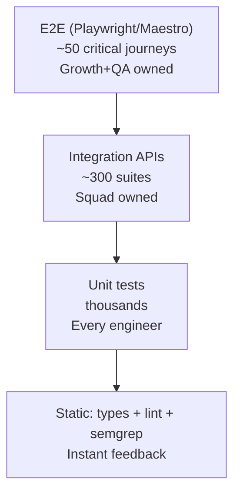

# Testing Guide

Testing is a first-class engineering responsibility. This guide covers what to write, how to write it, and how to run everything. The authoritative QA process, coverage gates, and severity/SLA model live in [QA & Release Readiness](../qa/README.md) and the [test plan](../qa/test-plan.md).

## Test pyramid & ownership



## Where tests live

| Layer | Tooling | Location | Command |
|---|---|---|---|
| Backend unit | Jest + ts-jest | `apps/backend/tests/unit` | `yarn test:unit` (in `@wco/backend`) |
| Backend integration | Jest + supertest (Testcontainers) | `apps/backend/tests/integration` | `yarn test:integration` |
| Backend coverage gate | Jest thresholds (70/60/70/70) | `apps/backend/jest.config.cjs` | `yarn test:coverage` |
| Frontend unit | Vitest + RTL + jsdom | `apps/frontend/src/**/*.test.ts(x)` | `yarn test` (in `@wco/frontend`) |
| Frontend E2E | Playwright (chromium) | `apps/frontend/tests/e2e` | `yarn test:e2e` |
| Frontend a11y | `@axe-core/playwright` (WCAG 2.1 AA) | `apps/frontend/tests/e2e/accessibility.spec.ts` | `yarn test:e2e` |
| Visual regression | Playwright + pixelmatch | `apps/frontend/tests/visual` | `yarn test:visual` |
| API performance | k6 | `infra/qa/k6` | `k6 run ...` |
| DAST | OWASP ZAP | `infra/qa/zap` | `qa.yml → dast` |
| Dependency policy | Snyk | root | `qa.yml → snyk` |

## Running the full suite

```bash
# Everything (unit + integration + e2e via turbo)
npm run test

# Layer-specific
npm run test:unit
npm run test:integration
npm run test:e2e

# With coverage thresholds enforced
yarn test:coverage

# Single workspace
npm run test --filter=backend
npm run test --filter=frontend

# E2E / visual in the frontend workspace
yarn --cwd apps/frontend test:e2e
yarn --cwd apps/frontend test:visual

# Load test
k6 run infra/qa/k6/buyer-journey.js
```

## How to write tests

### Unit tests (Vitest/Jest)

- Focus on pure functions and single behaviors; mock only at architectural boundaries.
- AAA structure: **Arrange, Act, Assert**.
- One behavior per test; use table-driven tests where natural.
- Payment calculations and pricing logic use **property-based testing** (fast-check).

```typescript
describe('PricingService', () => {
  describe('calculateOptimalPrice', () => {
    it('returns base price when no demand data', () => {
      const result = pricing.calculateOptimalPrice(product, { demand: 0 });
      expect(result).toBe(product.basePrice);
    });

    it('increases price under high demand', () => {
      const result = pricing.calculateOptimalPrice(product, { demand: 9 });
      expect(result).toBeGreaterThan(product.basePrice);
    });
  });
});
```

### Integration tests (Jest + Testcontainers)

- Use **real** PostgreSQL, Redis, RabbitMQ containers — no in-memory fakes.
- Isolate each suite via transaction rollback or a unique schema.
- Test webhook handlers with **real provider payload fixtures** (captured from staging).

```typescript
describe('OrdersModule', () => {
  it('creates order and emits OrderCreated event', async () => {
    const order = await api.post('/orders', createOrderDto, token);
    expect(order.status).toBe(201);
    // ... assert event published via outbox/queue
  });
});
```

### E2E tests (Playwright web / Maestro mobile)

- Cover critical revenue paths: **signup → store setup → product → order → payment → payout**.
- Run against staging with synthetic merchants; provision test users via the API.
- Quarantine a flaky test after 2 consecutive failures; fix within sprint.

### Non-functional tests

- **k6 load profiles** run monthly + pre-launch (p95 < 500ms, errors < 1%).
- **Lighthouse CI** budgets on every frontend PR (LCP < 2.5s, CLS < 0.1, TBT < 200ms).
- **Accessibility**: axe-core automated + manual audits quarterly (WCAG 2.1 AA target).

## Coverage gates

- **Changed-lines coverage ≥80%** (diff-based) enforced via `vitest --coverage.thresholds`.
- Global coverage is tracked as a trend metric, not a hard gate (avoids gaming).
- PRs that lower critical-path coverage are blocked.

## Test naming convention

```typescript
// Unit: describe + it
describe('PricingService', () => { it('...', () => {}) });

// Integration: describe + it
describe('OrdersModule', () => { it('...', async () => {}) });

// E2E: describe + test
test('customer can complete the purchase flow', async ({ page }) => {});
```

## QA gate (automatic per PR)

`.github/workflows/qa.yml` enforces, for every PR and push:

1. **Coverage gate** (backend + frontend thresholds)
2. **E2E** (full browser flows against mocked API)
3. **Accessibility** (axe scan all key routes)
4. **Performance** (k6 budgets — nightly)
5. **DAST** (OWASP ZAP baseline)
6. **Snyk** (dependency vulnerability/license)

`ci.yml` additionally runs lint, typecheck, secret scanning (gitleaks), SAST (Semgrep), CodeQL, sharded unit tests, and Testcontainers integration tests before images build.

Next: [Deployment guide](./09-deployment-guide.md).
