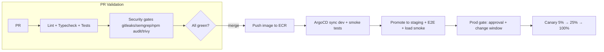

# Deployment Guide

This guide covers how code moves from a developer's laptop to production. The detailed operational procedures (with exact commands and rollback steps) are in the [Deployment runbook](../runbooks/01-deployment-runbook.md).

## Environments

| Environment | Source | URL | Purpose |
|---|---|---|---|
| Development | `develop` | dev.wco.com | Integration testing |
| Staging | `release/*` | staging.wco.com | Pre-production validation |
| Production | `main` | app.wco.com | Live traffic |

## How deployment works

Deployment is **automated** via GitHub Actions + ArgoCD + Argo Rollouts. Developers don't run production deploys manually in normal cases.



## Deployment strategy per service

| Environment | Strategy | Rollback |
|---|---|---|
| dev | Immediate on merge | Redeploy previous tag |
| staging | Rolling update | Helm rollback |
| prod | Canary via Argo Rollouts (5% → 25% → 100%, 10-min analysis) | Automatic on SLO burn > 2x |

## Database migrations

- Migrations are **backward-compatible only** (expand-migrate-contract).
- The migration job runs **before** new pods receive traffic.
- Old code must work with the new schema for one release cycle.
- Breaking changes take **two releases** (additive first, then removal).
- Migrations are reversible and tested **up and down** against prod-like data.

## deploy commands (when you need them)

```bash
# Development
npm run k8s:deploy:dev

# Staging
npm run k8s:deploy:staging

# Production (requires approval)
npm run k8s:deploy:prod
```

## Manual build & push (CI replicates this)

```bash
# Build all prod images
npm run build:prod

# Build docker images
npm run docker:build

# Deploy via kubectl (dev/staging)
kubectl apply -k infra/kubernetes/overlays/dev
kubectl apply -k infra/kubernetes/overlays/staging
```

## Pre-deploy checklist (production)

- [ ] All relevant PRs merged to `main`/`develop`
- [ ] CI + QA gates green
- [ ] Migrations reviewed + tested up/down
- [ ] Feature flags set as needed (`@wco/config/flags`)
- [ ] Release notes / changelog drafted
- [ ] No open P1 bugs on affected surfaces
- [ ] Staging smoke tests passed on the promoted sha

## Post-deploy verification

- [ ] Health endpoint `GET /health` returns ok
- [ ] Synthetic monitors green (Datadog)
- [ ] Key API p95 within SLO
- [ ] Error rate normal (Sentry / Grafana)
- [ ] Watch canary for a full analysis window before scaling to 100%

## Rollback

- Automatic rollback triggers on **SLO burn rate > 2x** during canary.
- Manual rollback: `helm rollback <release> <revision>` or redeploy previous image tag.
- See [Deployment runbook](../runbooks/01-deployment-runbook.md) for the exact rollback procedure.

## Environment-specific data policy

| Env | Data | Access |
|---|---|---|
| local | Docker compose + seed fixtures | Everyone |
| dev | Synthetic data generator, realistic volumes | Everyone (auth-gated) |
| staging | Anonymized copy of prod weekly (PII scrubbed) | Squad members |
| prod | Real | Break-glass only; read replicas for on-call with audit |

Next: [Monitoring & logging guide](./10-monitoring-logging-guide.md).
