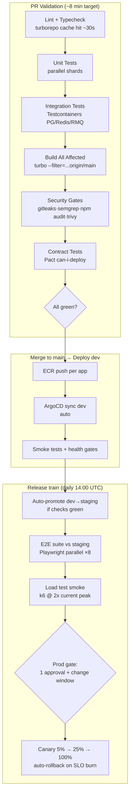
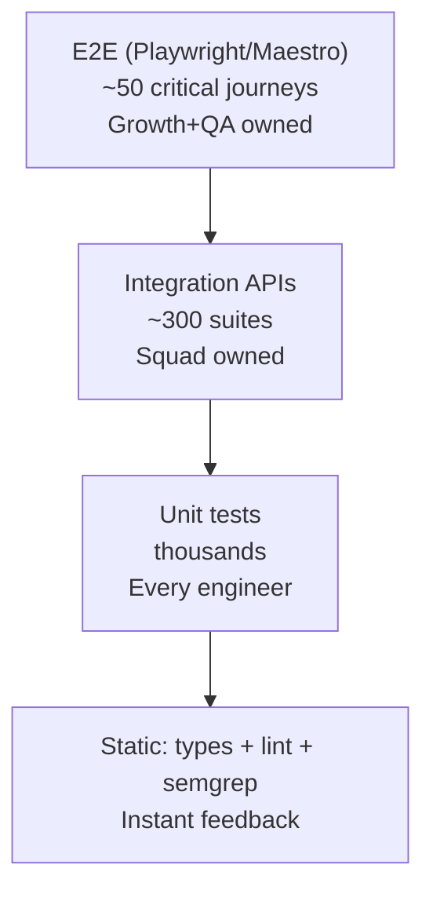

# WCO Development Workflow

## 1. Team Topology (Conway's Law by Design)

```
                    ┌─────────────────────────┐
                    │   Platform Team         │
                    │  (infra, CI/CD, shared) │
                    └───────────┬─────────────┘
                                │ enables
    ┌──────────────┬────────────┼────────────────┬──────────────┐
    │              │            │                │              │
┌───────────┐ ┌──────────┐ ┌───────────┐ ┌─────────────┐ ┌──────────┐
│ Merchant  │ │ Commerce │ │ Payments &│ │ AI/ML       │ │ Growth   │
│ Experience│ │ Core     │ │ Logistics │ │ Team        │ │ Team     │
│ (frontend,│ │ (backend │ │ Team      │ │ (ai-engine, │ │ (marketing,│
│ mobile)   │ │ orders,  │ │ (payments,│ │ pricing,    │ │ analytics │
│           │ │ products,│ │ logistics)│ │ forecasting)│ │ dashboards)│
└───────────┘ │ customers)│ └───────────┘ └─────────────┘ └──────────┘
              └──────────┘
```

Each squad: 1 EM, 1 PM, 1 designer, 4-6 engineers. Platform team runs internal golden paths.

## 2. Git Workflow — Trunk-Based with Short-Lived Branches

### Strategy
We use **trunk-based development** with feature flags — NOT long-lived GitFlow. Rationale: continuous deployment, smaller merge conflicts, faster feedback loops. `develop` branch exists only as a stabilization point for release trains if needed.

```mermaid
gitGraph
    commit id: "main"
    branch feat/JIRA-123-ai-responder
    commit id: "wip"
    commit id: "tests"
    commit id: "review fixes"
    checkout main
    merge feat/JIRA-123-ai-responder id: "squash merge" tag: "deployed behind flag"
    commit id: "..."
    branch hotfix/payment-webhook-timeout
    commit id: "fix"
    checkout main
    merge hotfix tag: "hotfix v1.2.1"
```

### Rules

| Rule | Value |
|------|-------|
| Branch lifetime | ≤2 days ideal, hard limit 3 days |
| PR size | <400 lines changed (excluding generated/lockfiles) |
| Commits on branch | Any style; squash-merged to main |
| Merge method | Squash only; merge commits forbidden |
| Direct pushes to main | Forbidden (even admins, except revert bots) |
| Feature flags | Every incomplete feature ships dark via LaunchDarkly-style flags (`@wco/config/flags`) |

### Branch naming
```
feat/JIRA-123-short-desc     → new features
fix/JIRA-456-short-desc      → bug fixes  
chore/desc                   → maintenance, no ticket needed for trivial
spike/desc                   → time-boxed experiments (never merged to prod paths)
release/vX.Y.Z               → release stabilization (rare)
```

## 3. Definition of Done (per story)

- [ ] Code complete with tests (unit ≥80% changed-lines coverage)
- [ ] Integration test for any API change (Testcontainers-based)
- [ ] Contract tests updated (Pact) if API surface changed
- [ ] Lint + typecheck + all tests green in CI
- [ ] Self-reviewed diff (author reviews own PR first)
- [ ] Documentation updated (README, ADR if architectural decision made)
- [ ] Feature flagged if user-facing and incomplete
- [ ] Migrations reversible; tested up AND down against prod-like data volume
- [ ] Observability added: metrics for new endpoints, structured logs, trace spans
- [ ] Security checklist passed (no secrets, inputs validated, authz enforced)
- [ ] Product owner acceptance (demo or screenshot/video in PR)

## 4. Code Review Process

### SLAs
| Priority | First response | Completion |
|----------|---------------|------------|
| Hotfix to prod | 15 min | Same day |
| Blocking another team | 4h | 1 day |
| Normal | Next business day start | 2 days |

### Review assignment (auto via CODEOWNERS)
- Path-based ownership routes PRs automatically
- Minimum 1 approval (2 for: payments/**, auth/**, migrations/**, security/**)
- Reviewer rotation prevents bottlenecks; CODEOWNERS groups round-robin

### Review standards
Reviewers evaluate (in priority order): **correctness > security > performance > readability > style**. Style is Prettier/ESLint's job, never a human comment.

Author responsibilities before requesting review:
1. CI green locally verified
2. PR description follows template (what/why/how-tested/screenshots)
3. Comments marking non-obvious decisions (`// NOTE:` / `// PERF:`)
4. Diff self-review pass completed

### Conflict resolution
Technical disagreements escalate: engineer ↔ reviewer discussion → squad tech lead → cross-squad RFC in `docs/adr/`. Decisions documented, never hallway-resolved.

## 5. CI/CD Pipeline Architecture

### Pipeline stages (GitHub Actions)



### Deployment strategy per service

| Environment | Strategy | Rollback |
|-------------|----------|----------|
| dev | Immediate on merge | Redeploy previous tag |
| staging | Rolling update | Helm rollback |
| prod | Canary via Argo Rollouts (5%→25%→100%, 10-min analysis windows) | Automatic on SLO burn rate >2x |

**Database migrations:** backward-compatible only (expand-migrate-contract pattern). Migration job runs BEFORE new pods receive traffic; old code must work with new schema for one release cycle. Breaking changes take two releases.

### Turborepo remote caching impact
- CI build times: ~18 min cold → ~4 min warm (measured on similar monorepos)
- Local `dev` tasks reuse cloud cache across the team

### Environments & data policy

| Env | Data | Access |
|-----|------|--------|
| local | Docker compose + seed fixtures | Everyone |
| dev | Synthetic data generator, realistic volumes | Everyone (auth-gated) |
| staging | Anonymized copy of prod weekly (PII scrubbed via `tools/migration/anonymize.ts`) | Squad members |
| prod | Real | Break-glass only; read replicas accessible for on-call with audit |

## 6. Testing Strategy (detailed)

### Test pyramid & ownership



### Standards per type

**Unit (Vitest/Jest):**
- Pure function focus; mocks only at architectural boundaries
- AAA structure; one behavior per test; table-driven where natural
- Payment calculations & pricing logic: property-based testing (fast-check)

**Integration (Jest + Testcontainers):**
- Real PostgreSQL, Redis, RabbitMQ containers — no in-memory fakes
- Each suite isolated via transaction rollback or unique schema
- Webhook handlers tested with REAL provider payload fixtures (captured from staging)

**E2E (Playwright web / Maestro mobile):**
- Critical revenue paths: signup→store setup→product→order→payment→payout
- Run against staging with synthetic merchants; test users provisioned via API
- Flakiness budget: quarantined after 2 consecutive failures, fixed within sprint

**Non-functional:**
- k6 load profiles run monthly + pre-launch
- Lighthouse CI budgets on every frontend PR (LCP<2.5s, CLS<0.1, TBT<200ms on Moto G4 profile)
- Accessibility: axe-core automated on component library + manual audits quarterly (WCAG 2.1 AA target)

### Coverage gates
- Changed-lines coverage ≥80% (diff-based, not global %) — enforced via `vitest --coverage.thresholds`
- Global coverage tracked as trend metric; no hard gate (avoids gaming)

## 7. Release & Versioning

- **Apps**: Continuous deployment; version = git SHA short + timestamp (`2026.08.21-a1b2c3d`)
- **Packages**: Changesets — version PRs auto-created, consumed semantically by apps
- **Mobile**: biweekly release train to TestFlight/Play internal → staged rollout 10%→50%→100% with crash-rate gates (Sentry release health)
- **API**: URL-versioned `/api/v1`; deprecation via `Sunset` header + 90-day minimum notice + usage tracking per consumer before kill

## 8. Onboarding Path (new engineer productive in ≤5 days)

| Day | Milestone |
|-----|-----------|
| 1 | Laptop + access (SSO), repo clone, `make bootstrap`, local stack running, deploy "hello world" flag flip to dev |
| 2 | Guided architecture tour (docs/architecture), shadow on-call for a day |
| 3 | First good-first-issue PR merged end-to-end through full pipeline |
| 4 | Domain deep-dive with squad; write a small integration test for an uncovered path |
| 5 | Ship first real story to production (behind flag), participate in review of someone else's PR |

Onboarding buddy assigned for 30 days; onboarding friction log maintained in `docs/onboarding/friction-log.md` — every complaint becomes a platform-team ticket.

## 9. Engineering Rituals

| Ritual | Cadence | Purpose |
|--------|---------|---------|
| Sprint planning | Bi-weekly, 90 min | Commitment from prioritized backlog |
| Standup | Async written (Slack thread) by default; voice only when blocked | Respect maker time across time zones (Lagos/Accra/Nairobi ±1h) |
| Demo Friday | Weekly, 45 min | Working software demos, company-wide |
| Retro | Bi-weekly per squad | Action items tracked, max 3 |
| Arch review | Weekly | RFCs/ADRs discussed, recorded |
| Ops review | Monthly | Incidents, SLO trends, flaky test debt, cost anomalies |
| Tech debt budget | 20% of each sprint, protected | Paid down ruthlessly or it compounds |
