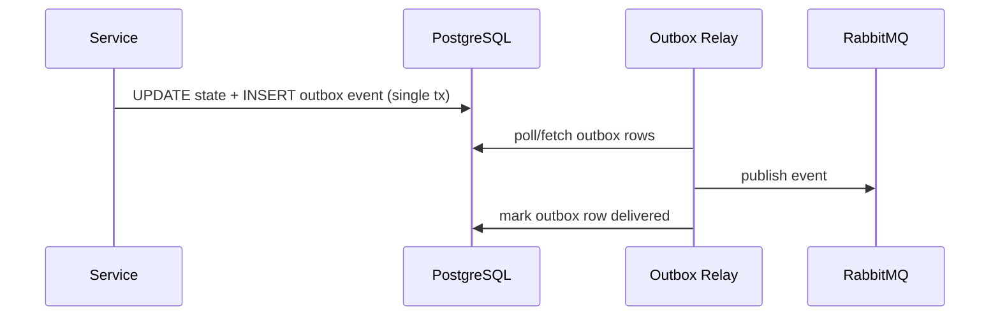

# Knowledge Base: Technical Deep Dives

In-depth explanations of specific technologies and subsystems. Each links to its canonical doc; this page adds the "why + how it fits together" context.

## The monorepo & build system

- **Tooling:** npm workspaces + Turborepo ([ADR-001](../adr/ADR-001-npm-workspaces-turborepo.md)).
- **Task graph:** `turbo run dev/build/test` orchestrates across `apps/*`, `packages/*`, `tools/*`.
- **Remote caching:** turborepo caches outputs so CI is fast (cold ~18 min → warm ~4 min).

| Workspace | Responsibility |
|---|---|
| `apps/backend` | API gateway + business logic (NestJS) |
| `apps/frontend` | merchant dashboard (Next.js) |
| `apps/mobile` | iOS/Android app (React Native/Expo) |
| `apps/ai-engine` | AI/ML service (Claude/OpenAI + Python/FastAPI) |
| `apps/webhook-handler` | inbound webhooks (WhatsApp/PSP) |
| `apps/admin-dashboard` | internal admin (Next.js) |
| `packages/*` | shared code (auth, payments, logistics, messaging, database, ui, …) |

## The transactional outbox (deep dive)

Why events are emitted as DB rows and relayed ([ADR-002](../adr/ADR-002-transactional-outbox.md)):

Guarantee: the state change and the event are committed **atomically** — no lost or duplicate events.

## Multi-tenant isolation (deep dive)

Two enforcement layers ([ADR-003](../adr/ADR-003-multi-tenancy.md)):
1. **Application:** `TenantContext` guard injects the active `storeId`; every query scopes by it.
2. **Database:** Postgres **Row-Level Security (RLS)** restricts rows by `storeId` as a backstop.
Result: even a migrated query or a leaked direct DB connection cannot read another store's data.

## The AI engine

- **Flow:** inbound WhatsApp → queue → AI service → catalog + store AI config → LLM prompt → reply → send back ([Data flow](../architecture/data-flow.md)).
- **Stack:** Claude/GPT + embeddings (Pinecone) + LangChain/custom templates.
- **Guardrails:** price/conversation budget (`/ai-configs/test` rate limit), handoff for buying-intent, catalog-grounded answers.
- **Deep dive:** `apps/ai-engine` and [Messages guide](../user/guides/messages-guide.md).

## Payments abstraction

- Providers (Paystack/Flutterwave/OPay) behind `packages/payments` abstractions.
- **No PAN storage** — hosted/tokenized checkout ([PCI DSS](../compliance/03-pci-dss.md)).
- Payment links + webhook verification (HMAC) → order marked Paid.

## Observability pipeline

- Metrics: Prometheus + Grafana. Logs: structured JSON → ELK/Loki. Traces: OpenTelemetry + Jaeger. Errors: Sentry.
- **Correlation:** `requestId` ties a single request across logs, trace, and Sentry.
- See [Monitoring guide](../developer/10-monitoring-logging-guide.md).

## Deep-dive topics to explore further
- [System architecture](../architecture/system-architecture.md)
- [Scaling plan](../architecture/scalability-plan.md)
- [Database design & indexing](../database/README.md)
- [API design guidelines](../api/design-guidelines.md)

## Contributing a deep dive
Add a focused doc here (or in `apps/*`) when a subsystem needs explanation beyond its README. Keep it implementation-accurate and link canonical references.
