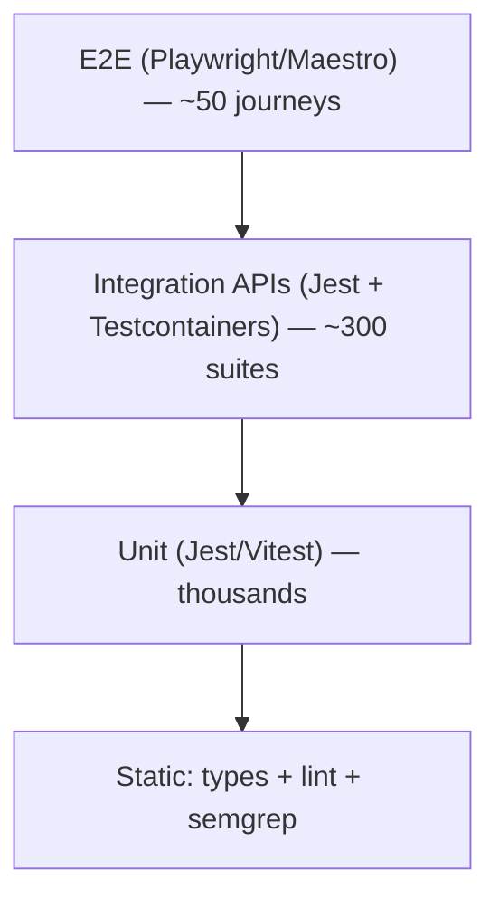

# Onboarding — Testing Guide

How to write and run tests as a WCO engineer. Full detail: [Testing guide](../developer/08-testing-guide.md) and [QA & release readiness](../qa/README.md).

## The pyramid

## Where tests live & how to run

| Layer | Run |
|---|---|
| Backend unit + integration | `npm run test:unit` / `npm run test:integration` (in @wco/backend) |
| Frontend unit | `yarn test` (in @wco/frontend) |
| E2E (web) | `yarn --cwd apps/frontend test:e2e` |
| Visual regression | `yarn --cwd apps/frontend test:visual` |
| Coverage gate | `yarn test:coverage` |
| Load (k6) | `k6 run infra/qa/k6/buyer-journey.js` |

## Minimum requirements on your PRs
- **Unit** on changed code (changed-lines ≥ 80% coverage; enforcement via Vitest thresholds).
- **Integration** for any API change (Testcontainers with real PG/Redis/RMQ — no in-memory fakes).
- **Contract** (Pact) if the API surface changed.
- **E2E** for critical journeys (auth, orders).

## What to write
- **Unit:** pure function focus, AAA structure, one behavior per test. Property-based tests for payment/pricing math.
- **Integration:** real containers, transaction-isolated; webhooks tested with **real provider payload fixtures**.
- **E2E:** critical revenue paths (signup → store → product → order → payment → payout) against staging with synthetic merchants.

## Test naming
- Unit/Integration: `describe(...)` + `it(...)`.
- E2E: `describe(...)` + `test(...)`.

## The QA gate (automatic, per PR)
`qa.yml` enforces: coverage gate, E2E, accessibility (axe), performance budget (nightly k6), DAST (ZAP), dependency policy (Snyk). `ci.yml` adds lint, typecheck, gitleaks, Semgrep, CodeQL, sharded unit, Testcontainers integration.

> If a E2E test is flaky, it's quarantined after 2 consecutive failures and fixed within the sprint — don't merge past a red gate.

## Coverage targets

| Layer | Target | Critical paths |
|---|---|---|
| Unit | 80% | 100% |
| Integration | 70% | 90% |
| E2E | key flows | 100% |

## Need help?
Ask your buddy/QA for guidance on the right test for your change. If you find a gap in this guide, improve it.
