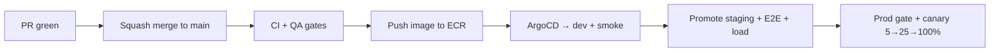

# Onboarding — Deployment Guide

How code you merge gets to production, and your role in it. Full detail: [Deployment guide](../developer/09-deployment-guide.md) and [Deployment runbook](../runbooks/01-deployment-runbook.md).

## How deploys work (automated)



**You rarely deploy manually** — merging a green PR to the right branch triggers dev; staging/prod follow the release train and prod gates.

## Environments

| Env | Source | URL |
|---|---|---|
| dev | `develop` / `main` | dev.wco.com |
| staging | `release/*` | staging.wco.com |
| prod | `main` (gated) | app.wco.com |

## Your responsibilities
- Respect **change windows** and the **prod gate** (approval) — don't bypass.
- Ensure your PR has **no dangerous migrations** without following the [migration rules](../developer/09-deployment-guide.md#database-migrations) (backward-compatible; two-release rule for breaking).
- **Verify** your deployed change post-launch (monitor, health).
- If a deploy you're responsible for regresses, help **rollback** or **[complete the incident flow](../runbooks/03-incident-response-runbook.md)**.

## Manual commands (when you need them)

```bash
npm run k8s:deploy:dev        # dev
npm run k8s:deploy:staging    # staging
npm run k8s:deploy:prod       # prod (requires approval)

kubectl apply -k infra/kubernetes/overlays/dev
```

## Rollback basics
- Canary auto-rolls back on SLO burn > 2x.
- Manual: `helm rollback <release> <revision>` or redeploy previous image tag.
- Rollback only for behavioral regressions; don't roll back schema with data simultaneously.

## Post-deploy verification
- [ ] Health `GET /health` ok.
- [ ] Synthetic monitors green.
- [ ] Errors/latency within SLO (Grafana/Datadog).
- [ ] Key transaction path works.

## Environment data policy
local = seed fixtures · dev = synthetic data · staging = anonymized copy of prod (PII scrubbed) · prod = real (break-glass access).

> **Never develop against production data.** Use dev/staging.
