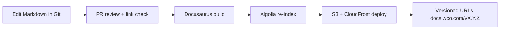

# Documentation Platform Setup

This document describes how the WCO documentation platform (docs.wco.com) is configured for structure, search, versioning, access control, analytics, and feedback.

## 1. Platform technology decision

| Concern | Choice | Why |
|---|---|---|
| Primary platform | **Docusaurus 3** (static, Markdown-first) | Versionable in-git, searchable, fast, supports Mermaid, free to self-host, SSG friendly, D2C (docs-as-code) |
| Alternate (docs as a service) | GitBook | If we need managed subscriptions/who-owns-what for external users; we keep content in Markdown so migration is trivial |
| Publishing | GitHub → static build → AWS S3 + CloudFront (docs.wco.com) | Cheap, global CDN, versioned deploys, atomic |
| API reference | **Redocly** served from [`docs/api/openapi.yaml`](../api/openapi.yaml) | Renders the source-of-truth OpenAPI spec with searchable, elegant layout |
| Diagrams | **Mermaid** inline in Markdown | Version-controlled, renders on GitHub & Docusaurus |
| Code docs | **TSDoc/JSDoc** + TypeDoc generated per package | Keeps code documentation close to code |

**Rationale (ADR reference):** We chose docs-as-code over a hosted wiki because our documentation must be:
1. Version-locked to the code that ships it (same repo, same PR).
2. Reviewable via the normal Git workflow (lint, link-check, diff).
3. Self-hostable at billion-dollar scale (no per-seat license limits for 1M users).
4. Portable — Markdown content is vendor-neutral if we ever move to GitBook/Notion.

## 2. Directory structure & categories

```
docs/                                # all docs live here as Markdown (SSG source)
├── developer/                       # Developer Documentation
├── user/                            # User Documentation
├── api/                             # API Documentation (canonical OpenAPI + guides)
├── runbooks/                        # Operations Runbooks
├── playbooks/                       # Operations Playbooks
├── troubleshooting/                 # Support Troubleshooting guides
├── compliance/                      # Compliance Documentation
├── security/                        # Security Documentation
├── onboarding/                      # Onboarding Documentation
├── knowledge-base/                  # Knowledge Base (ADRs, deep dives, best practices)
├── platform-style/                  # Docs platform, style, maintenance, localization
├── adr/                             # Architecture Decision Records
├── database/                        # Database design & reference
└── docusaurus.config.js             # platform config (sidebar, plugins, search)
```

### Sidebar (navigation) configuration

The Docusaurus sidebar mirrors the audience-first map in [`docs/README.md`](./README.md):

```javascript
// docs/docusaurus.config.js (abridged)
module.exports = {
  title: 'WhatsApp Commerce OS',
  tagline: 'AI-powered commerce OS for informal traders in emerging markets',
  url: 'https://docs.wco.com',
  baseUrl: '/',
  onBrokenLinks: 'throw',            // fail CI on broken internal links
  onBrokenMarkdownLinks: 'warn',
  defaultMode: 'light',
  presets: [
    [
      'classic',
      {
        docs: {
          routeBasePath: '/',
          sidebarPath: require.resolve('./sidebars.js'),
          editUrl: 'https://github.com/anomalyco/wco/edit/main/docs/',
        },
        blog: false,
        theme: { customCss: require.resolve('./src/css/custom.css') },
      },
    ],
  ],
  themeConfig: {
    navbar: {
      title: 'WCO Docs',
      items: [
        { to: '/developer/01-introduction', label: 'Dev', position: 'left' },
        { to: '/user/01-getting-started', label: 'Users', position: 'left' },
        { to: '/api/README', label: 'API', position: 'left' },
        { to: '/runbooks/README', label: 'Ops', position: 'left' },
        { to: '/compliance/README', label: 'Compliance', position: 'left' },
        {
          href: 'https://status.wco.com',
          label: 'Status',
          position: 'right',
        },
      ],
    },
    docs: { sidebar: { autoCollapseCategories: true } },
    algolia: { /* search config, see below */ },
  },
};
```

## 3. Search functionality

We use **Algolia DocSearch** (free for open-source / self-managed crawl) for the published site:

- **Crawler** runs on every docs deploy (GitHub Action) and re-indexes `docs.wco.com`.
- **Search indexes** every page, heading, and code block.
- **Facets** let users filter by section (developer vs API vs runbooks).
- **Fallback**: Docusaurus built-in `lunr`/`local` search is enabled in the repo so `npm run docs:serve` supports search offline without a network crawl.

### Search configuration (Algolia)

```javascript
// docusaurus.config.js → themeConfig.algolia
{
  appId: 'YOUR_APP_ID',
  apiKey: 'YOUR_SEARCH_ONLY_KEY',
  indexName: 'wco_docs',
  contextualSearch: true,           // scope results to current section
  searchParameters: {},
}
```

## 4. Versioning

Documentation is versioned to match product and API releases:

- **Docs version = product release** (`v1.0.0`, `v1.1.0`, …). Each tagged release freezes the docs at that point.
- **`docs/current`** always reflects `main` (unreleased/next).
- **API docs** version with the API: `v1` (current), `v2` (in development), and past versions archived.
- Version banners warn readers when they're on an old docs version.
- Deprecated endpoints/pages carry `Deprecation:` + `Sunset:` headers and a banner, matching the [API versioning policy](../api/design-guidelines.md#8-versioning--deprecation-policy).

```bash
# Docusaurus versioning CLI
npm run docusaurus docs:version v1.0.0    # freeze current docs as v1.0.0
npm run docusaurus docs:version v1.1.0    # next release
```

## 5. Access control

Because the docs are served statically from S3+CloudFront, **public** documentation (user guides, public API reference) is open. **Internal** documentation (runbooks with credentials, security incident playbooks, on-call procedures) is access-controlled:

- **Public** — user guides, public API, developer intro, onboarding public parts.
- **Internal / gated** — runbooks, playbooks, database credentials, security incident response, compliance audits.

### Access control strategy

1. **Route segments:** internal docs live under `/internal/*` on the CDN.
2. **CloudFront + Lambda@Edge (or Cognito) auth:** `/internal/*` requires SSO (Okta/Azure AD with SAML) — employees and contractors sign in with their work identity.
3. **github.com repo permissions:** the source in Git enforces read access by team membership; sensitive content is not in the public render.
4. **Secrets:** never store secrets in docs. Database credentials, API keys, and tokens are referenced by placeholder and resolved via AWS Secrets Manager at deploy/runtime — see [Security: Overview](./security/01-security-overview.md) and [Runbooks: Security](./runbooks/08-security-runbook.md).

### Access matrix

| Content | Public | SSO-gated | Repo-role-gated |
|---|---|---|---|
| Developer intro / overview | ✅ | | |
| User guides | ✅ | | |
| Public API reference | ✅ | | |
| API design guidelines | ✅ | | |
| Onboarding (public) | ✅ | | |
| Runbooks (deploy, backup, DB) | | ✅ | |
| Playbooks (incident, DR) | | ✅ | |
| Compliance audit procedures | | ✅ | |
| Security incident response | | ✅ | ✅ (admin) |
| ADR internal notes | | ✅ | |
| Database credential runbooks | | ✅ | ✅ (ops) |

## 6. Analytics

Documentation usage analytics help us understand what users read, what's confusing, and what to prioritize.

- **Tool:** Plausible (privacy-friendly) + Google Analytics 4 for the public docs.
- **Events tracked:**
  - Page views per section/page.
  - Search queries (top queries, zero-result queries → content gaps).
  - Outbound links (to support, status page, API reference).
  - Time-on-page / scroll depth for user guides.
- **Privacy:** analytics are cookieless / DNT-respecting by default; no PII is collected — consistent with our [GDPR posture](./compliance/01-gdpr.md).

```javascript
// docusaurus.config.js
plugins: [
  [
    'docusaurus-plugin-plausible',
    { domain: 'docs.wco.com', scriptProps: { 'data-domain': 'docs.wco.com' } },
  ],
],
```

## 7. Feedback

Every documentation page has a built-in feedback mechanism:

- **"Was this page helpful?"** thumbs up/down widget at the end of every page.
- **"Edit this page"** link → opens a prefilled GitHub PR to the Markdown source (editUrl above).
- Feedback is routed to the `#docs` Slack channel and triaged weekly by the docs owners.
- Zero-result searches and negative feedback become tickets in the docs backlog (see [Maintenance](./04-maintenance.md)).

## 8. Build & deploy pipeline



Docs deploy is wired into CI (`.github/workflows/docs.yml`, added when the site repo is enabled) and independent of the product deploy so documentation can ship on its own cadence.

## 9. Runbooks for the docs platform

| Task | Command / step |
|---|---|
| Serve docs locally | `npm --workspace docs run start` (or `make docs`) |
| Build static site | `npm --workspace docs run build` |
| Check broken links | `npm --workspace docs run lint:links` |
| Version | `npm --workspace docs run docs:version vX.Y.Z` |
| Deploy to prod | merge to `main` of the docs source; GitHub Action deploys |

## 10. Decisions & trade-offs

- **Docs-as-code over hosted wiki** — chosen for version-locking, review, portability, and unlimited scale. We accept higher setup effort.
- **Mermaid over hosted draw.io** — diagrams live in text, are diffable, and render everywhere; we lose some drag-and-drop editing, which the style guide compensates for with conventions.
- **OpenAPI-single-source** — the API reference is generated from `openapi.yaml`, so endpoint docs can never drift from implementation (a `oasdiff` gate fails CI on breaking changes).
- **Redocly over Swagger UI** — cleaner theming and better search for a public, high-traffic reference.
