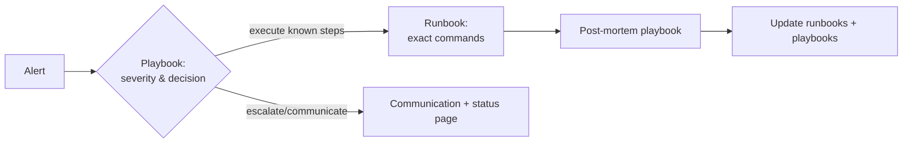

# Playbooks — Operations

Playbooks are the **decision frameworks and rehearsal guides** for handling operational scenarios. They complement the procedural [Runbooks](../runbooks/README.md): playbooks say *how to think & communicate*, runbooks say *exactly what commands to run*.

> When an alert fires, the runbook gives the steps; the playbook gives the judgment — severity, who leads, what to say, and how to learn afterward.

## Playbook index

| # | Playbook | Focus |
|---|---|---|
| 01 | [Incident management](./01-incident-management-playbook.md) | Declare, command, communicate, resolve incidents |
| 02 | [On-call](./02-on-call-playbook.md) | Duties, expectations, handoff |
| 03 | [Post-mortem](./03-post-mortem-playbook.md) | Blameless reviews, templates, action tracking |
| 04 | [Capacity planning](./04-capacity-planning-playbook.md) | Forecast, budgeting, load testing |
| 05 | [Disaster recovery](./05-disaster-recovery-playbook.md) | RTO/RPO, failover, drills |
| 06 | [Security incident](./06-security-incident-playbook.md) | Confirm, contain, eradicate, recover, learn |
| 07 | [Compliance](./07-compliance-playbook.md) | Maintain posture, audits, evidence |

Each playbook contains its own **preparation** (train/tabletop) and **execution** sections so teams can rehearse before a real event.

## How playbooks and runbooks relate

## Cross-references
- Procedural runbooks: [`docs/runbooks/`](../runbooks/README.md)
- QA severity & SLAs: [`docs/qa/README.md`](../qa/README.md)
- On-call schedule/ownership: Notion (internal)
