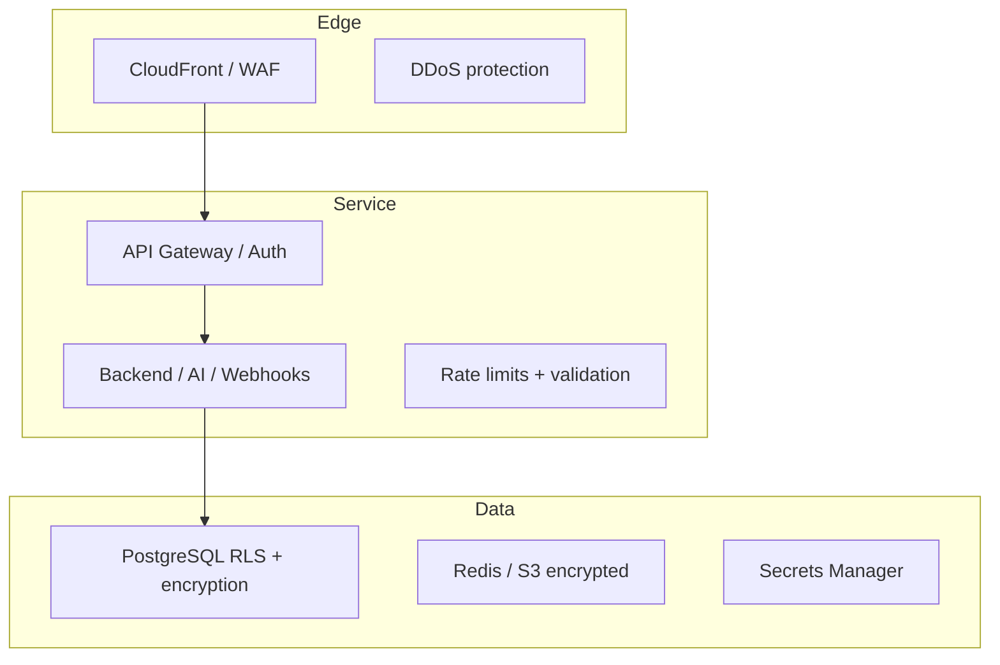

# Security Overview

WCO's overall security architecture and the controls protecting the platform, its users, and customer data.

## Threats WCO defends against

| Threat | Primary defenses |
|---|---|
| Unauthorized access | AuthN (JWT/refresh), AuthZ (RBAC + permission strings), tenant isolation |
| Cross-tenant access | `TenantContext` guard + Postgres RLS backstop |
| Injection (SQL/XSS) | ORM parameterization, input validation, output encoding; SAST gates |
| Credential compromise | Refresh-token rotation + family revocation, rate-limited auth, MFA option |
| Data breach / exfiltration | Encryption at rest/transit, network policies, secret hygiene, audit |
| Abuse / scraping | Rate limits, WAF, anomaly monitoring |
| Supply chain | Snyk, Trivy, Dependabot, pinned/verified dependencies |

## Security by design principles
1. **Zero trust** — verify every request; least privilege everywhere.
2. **Defense in depth** — multiple independent controls per risk.
3. **Least privilege** — roles/network/secrets grant the minimum needed.
4. **Fail closed** — on doubt (signature, permission, tenancy), deny.
5. **Privacy by design** — GDPR/NDPR built into data handling.
6. **Observability** — security events are logged & monitored.
7. **Incident-ready** — defined response, runbooks, and escalation.

## The layered stack

## Core control inventory

| Control | Details |
|---|---|
| **Authentication** | JWT (15-min access) + rotating refresh tokens; API keys for M2M; optional 2FA; SSO for staff ([AuthN/AuthZ](./02-authentication-authorization.md)) |
| **Authorization** | RBAC roles (OWNER/ADMIN/AGENT/VIEWER) + permission strings per route |
| **Tenant isolation** | Store-scoped queries + RLS |
| **Encryption** | TLS 1.2+/1.3 in transit; AES-256 at rest; envelope encryption for tokens ([Encryption](./03-data-encryption.md)) |
| **Network** | Default-deny network policies, egress allowlists, WAF ([Network](./04-network-security.md)) |
| **Secrets** | AWS Secrets Manager; never in Git; rotation; CI OIDC federation ([Security runbook](../runbooks/07-security-runbook.md)) |
| **Software** | CodeQL SAST, semgrep, gitleaks, Trivy, Dependabot, ZAP DAST, 2-reviewer approval on sensitive paths ([Vulnerability mgmt](./05-vulnerability-management.md)) |
| **Monitoring** | Security Hub, GuardDuty, anomaly alerts, audit logs ([Monitoring](./06-security-monitoring.md)) |
| **Response** | S1–S4 severity ladder; PagerDuty; breach notification ([Incident response](./07-security-incident-response.md)) |

## Data classification recap
| Class | Examples | Controls |
|---|---|---|
| Public | marketing/static | baseline |
| Internal | dashboards, deploy records | RBAC, least privilege |
| Sensitive | business profile, orders | encryption, RBAC, audit |
| Restricted | payment tokens, secrets | KMS, Secrets Manager, no raw logs |

## Reporting
- Vulnerabilities: **security@wco.com** (24h ack, 72h triage). See [`SECURITY.md`](../../SECURITY.md) for safe harbor.
- Attestation/soc reports: security@wco.com under NDA.
