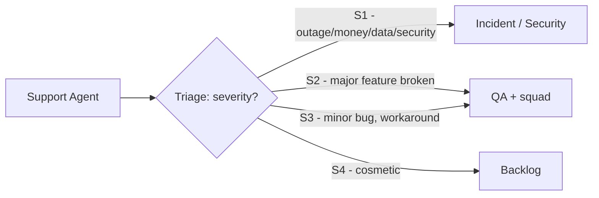

# How to Escalate Issues

When a support ticket is beyond the support agent's authority or the resolution failed, escalate **promptly and with context** — never guess on money, data, or security.

## Escalation ladder

## Severity & SLA (from QA)

| Severity | Definition | 1st response | Fix target |
|---|---|---|---|
| **S1** | Outage, data loss, money loss, security incident | 15 min | 24h hotfix |
| **S2** | Major feature broken; workaround exists | 4h | 72h |
| **S3** | Minor bug; no impact blocker | 24h | next release |
| **S4** | Cosmetic / friction | 72h | backlog |

## When to escalate

| Trigger | Escalate to | Do NOT |
|---|---|---|
| Confirmed **outage** affecting many users | Incident (bridge) via [Incident response runbook](../runbooks/03-incident-response-runbook.md) | keep resolving tickets individually |
| **Money** (payment/refund discrepancy) | Payments/ops + incident if S1 | manually alter financial state |
| **Data loss / corruption** | Data owner + [Backup runbook](../runbooks/04-backup-recovery-runbook.md) | perform destructive actions |
| **Security / fraud / breach** | Security immediately ([Security incident playbook](../playbooks/06-security-incident-playbook.md)) | "wait and see" |
| **Product bug** (reproducible) | QA via [defect process](../qa/process.md) | work around silently |
| Stuck > 30 min with no hypothesis | Shift lead / ops on-call | spin on the ticket |

## How to escalate (the handoff)

Provide **everything** the next person needs in one place:
- Account/store id + `requestId` + error message + screenshots/recording.
- What was tried + result.
- Severity assessment.
- Any time-sensitivity (revenue at risk, regulatory, large customer).

Use the **type/bug** labels and SLA flags in the issue tracker so severity is tracked (see [QA process](../qa/process.md)).

## Escalation ownership
- The **escalator is responsible** until a clear owner accepts the escalation.
- The **acceptor** sets next-step expectations and communicates status.
- If no response within the SLA, escalate further up the chain (support lead → ops → leadership).

## Escalation on-call (after hours)
- Outages → page on-call per [On-call playbook](../playbooks/02-on-call-playbook.md).
- Payment/security severity S1 → page immediately (never defer to morning).
