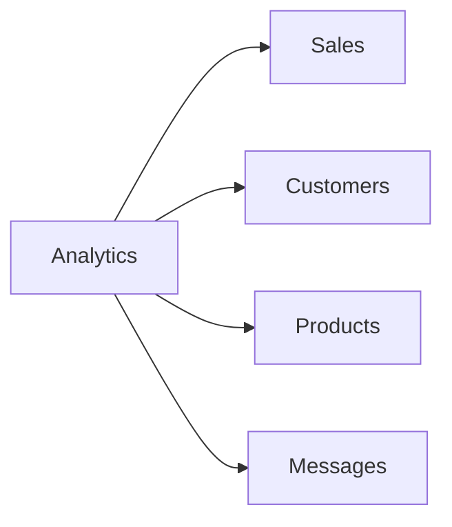

# Analytics Guide

Understand your business with clear, real-time analytics on sales, customers, products, and messages. Data-driven decisions grow your store.

## Analytics overview

The **Analytics** page gives you reports across four areas, with date-range filters (today / 7 days / 30 days / custom).

## Sales analytics

- **Revenue** — total, trends, and by day/week/period.
- **Orders** — count, average order value (AOV), conversion.
- **Payment methods** — how customers pay.
- **Refunds** — value and count.

### Reading sales analytics
- **Spikes** — what drove them? (promotion, event, product drop → repeat it).
- **Dips** — investigate (out of stock? less traffic? weekend pattern).

## Customer analytics

- **Total customers** and **new customers** per period.
- **Repeat rate** — % of customers who buy again (loyalty health).
- **Customer lifetime value (LTV)** — revenue per customer.
- **Top customers** — your highest-value buyers (send them a thank-you!).

## Product analytics

- **Top products** by revenue and units sold.
- **Low performers** — candidates to discount, repackage, or drop.
- **Stock health** — fast-movers (restock early) vs slow-movers.

## Message analytics

- **Messages received** — volume and trend.
- **Unanswered vs AI-handled** — how well is your AI doing?
- **AI resolution rate** — how many conversations the AI fully handled.
- **Response time** — average time to first reply (aim for the AI's ~5s).

## Interpreting & acting

| Metric | If it's low | Action |
|---|---|---|
| Repeat rate | Few returning customers | Thank-you messages, loyalty discount, follow-ups |
| AOV | Low order value | Bundle/upsell, free delivery threshold |
| AI resolution rate | AI passing too much to you | Improve AI templates, more catalog detail |
| Unanswered messages | Customers waiting | Check AI/handoff; reply faster |
| Top product stock | Running low | Restock fast-movers first |

## Filters & exports

- **Date range** on every report.
- **Export** any report to CSV for deeper analysis.
- Reports respect your store's **currency** and **timezone**.

## FAQ

| Question | Answer |
|---|---|
| How fresh is the data? | Near real-time; dashboards refresh frequently. |
| Can I compare periods? | Yes — use the date-range filter. |
| Can I see per-product profit? | If you set a cost price, WCO can show margin. |
| Is my data private? | Yes — it's scoped to your store. See [Privacy](../compliance/README.md). |

Need more? → [Troubleshooting](../troubleshooting/README.md)
