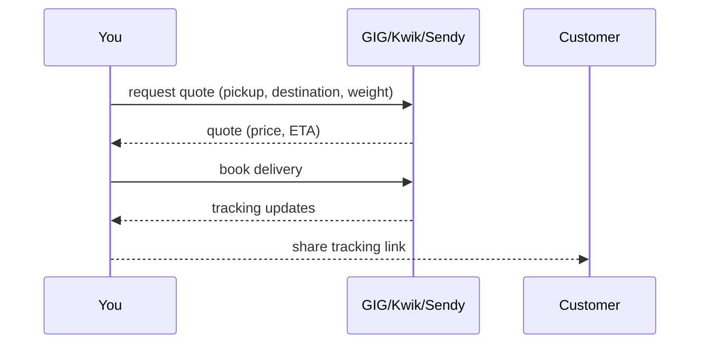

# Deliveries Guide

Arrange and track delivery for your orders. WCO integrates with **GIG Logistics, Kwik, and Sendy** so you can get things shipped in about two minutes.

## Setting up delivery

**Settings → Delivery:**

1. Choose your **delivery provider(s)** (GIG, Kwik, Sendy).
2. Connect your provider account.
3. Set **delivery rates** (flat fee, by distance/zone, or free over a threshold).
4. Set the **delivery area** you serve.
5. **Save & verify.**

## How delivery works

- WCO requests a **quote**, you confirm, then WCO **books** the delivery.
- You (or the customer) get **real-time tracking**.

## Delivery options

- **Request a quote** — get price + ETA before committing.
- **Book delivery** — dispatch the parcel via the provider.
- **Pickup** — customer collects (no logistics).
- **Local delivery** — your own arrangement (track manually in the order).

## Managing deliveries

- In an order, under **Delivery**, choose provider + destination.
- Set the **delivery date/time** if needed.
- **Track** live status from the provider.
- **Share tracking** with the customer.

## Delivery statuses

| Status | Meaning |
|---|---|
| Quote requested | Quote pending from provider |
| Booking | Being booked |
| In transit | Out for delivery |
| Delivered | Customer received it |
| Failed / returned | Delivery issue (retry / customer contact) |

## Delivery fees

- Fees come from your **delivery rates** and any provider quote.
- You can show delivery fees to customers **before** checkout so there are no surprises.
- Optionally offer **free delivery** over a minimum order total.

## Troubleshooting

| Issue | Fix |
|---|---|
| No delivery provider available | Connect one in Settings → Delivery |
| Quote taking long | Try another provider or contact provider support |
| Wrong delivery fee | Update delivery rates; check zone rules |
| Delivery delayed | Check tracking; contact provider via support |

Need more? → [Troubleshooting](../troubleshooting/README.md)
