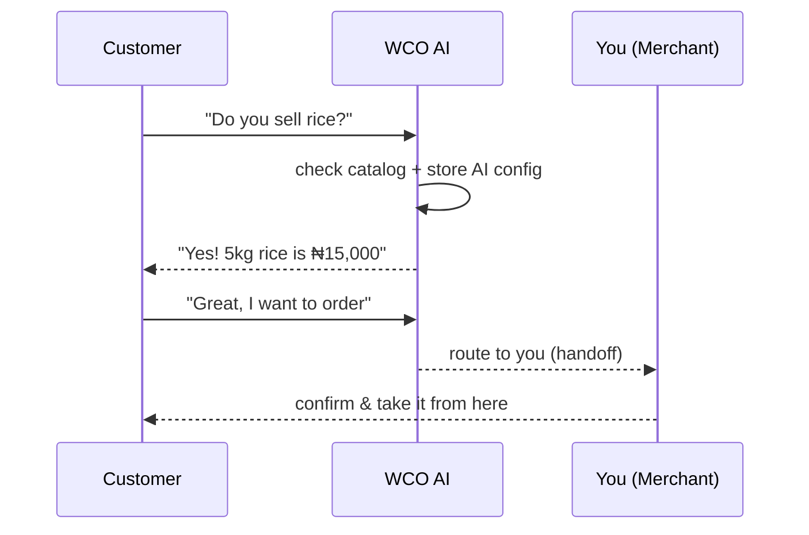

# Messages Guide — WhatsApp + AI Auto-Responder

The Messages page is where your WhatsApp conversations live, and where the **AI auto-responder** does its magic. This is WCO's signature feature: customers message your WhatsApp, and a helpful AI answers in ~5 seconds.

## The inbox

- **Messages** shows all WhatsApp conversations with your customers.
- Each thread shows recent messages, the customer, and unread/unanswered status.
- Filters: **Unanswered**, **AI-handled**, **All**.

### Unanswered (your to-do list)
Messages the AI couldn't fully handle (e.g., a customer wants to buy, asks something specific, or requests human help). Reply to these — every one is a potential sale.

### AI-handled
Conversations the AI answered. Review them occasionally to keep quality high.

## How the AI auto-responder works

The AI:
- Reads your **product catalog** for accurate answers.
- Uses **your response templates** (tone, language) you define.
- **Hands off to you** when it can't answer or the customer wants to buy.
- Learns from your store's common questions over time.

## Turning the AI on/off

**Settings → AI (or Messages → AI settings):**
- **Enable auto-reply** toggle.
- Choose a **default response template** and add custom templates for FAQs.
- Turn on **handoff** so complex/buying-intent messages reach you.
- Set a **fallback** reply when the AI isn't confident.

## Writing good AI templates

Keep templates **short, friendly, and on-brand**:

> "Hi {{customer_name}}! 👋 Thanks for reaching out to {{store_name}}. Here's what we have: {{product_list}}. How can I help?"

Common FAQs to template: prices, delivery fees, delivery time, payment options, opening/order times.

## Sending messages

- Reply inside any thread manually anytime (AI is paused while you type).
- **Broadcast / campaign:** send a message to a customer **segment** (with opt-in consent — see [Customers guide](./customers-guide.md#marketing-responsibly)).

## Conversation context

- Threads keep full history so you (and the AI) remember context.
- Any customer becomes a [Customer profile](./customers-guide.md) automatically, with the chat attached.

## AI "takeover" (human intervention)

When you take over a conversation, the AI stops replying and you drive. You can hand it **back** to the AI anytime. This gives you full control.

## Troubleshooting

| Issue | Fix |
|---|---|
| AI not replying | Check WhatsApp connected + AI enabled (Settings → AI) |
| AI gives wrong price | Update the product in Products (AI uses current data) |
| AI not handing off for orders | Turn on **handoff** in AI settings |
| Customer wants a human | Take over the conversation manually |
| No messages appearing | Confirm WhatsApp number is connected & webhook active |

Need more? → [Troubleshooting](../troubleshooting/README.md)
