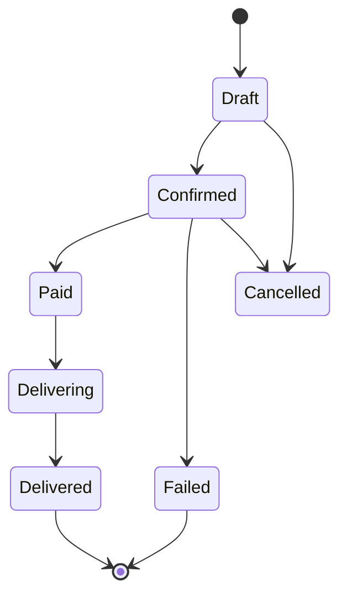

# Orders Guide

Manage everything related to sales: creating orders, processing payments, and arranging delivery. Orders are the heart of your business.

## Order lifecycle

An order moves through statuses as you fulfill it:

| Status | Meaning |
|---|---|
| **Draft** | Order created but not yet confirmed |
| **Confirmed** | You've accepted the order |
| **Paid** | Payment received |
| **Delivering** | Logistics in progress |
| **Delivered** | Customer received it |
| **Failed** | Payment failed (retry possible) |
| **Cancelled** | Order cancelled |

## How orders are created

1. **WhatsApp** — a customer orders in chat; the AI or you create the order.
2. **Manually** — you tap **+ New order** and pick products/customer.
3. **Dashboard** — via the API for advanced users.

## Viewing orders

- **Orders** page lists all orders with status, customer, total, and date.
- **Filters** — by status, date range, customer, or product.
- **Search** — by order ID or customer name.

## Processing an order

1. Open the order.
2. **Confirm** it (if still draft).
3. If not already paid, **send a payment link** to the customer (see Payments).
4. When paid, **arrange delivery** or mark for pickup (see Deliveries).
5. **Deliver** and confirm.

## Order details

Each order shows:

- **Customer** — name, phone/WhatsApp, address.
- **Items** — product, quantity, unit price, line total.
- **Totals** — subtotal, delivery, discount, grand total.
- **Payment** — status and method.
- **Delivery** — provider, tracking, status.
- **Timeline** — every status change with timestamps (audit trail).

## Sending a payment link

- Open the order → **Send payment link**.
- A link is generated (Paystack/Flutterwave/OPay).
- Send it to the customer via WhatsApp/SMS.
- The order updates to **Paid** when the customer completes payment.

## Handling failed/cancelled orders

- **Failed payment** → resend the payment link; the link is still valid.
- **Cancelled** → optionally restock quantities and record a reason.

## Recurring / repeat orders

- Reorder a past order with **Reorder** — copies the same items in one tap.
- Great for stocking customers who buy the same things regularly.

## Analytics tie-in

Order data feeds your [Analytics](./analytics-guide.md): revenue, top products, order value, and more.

## Troubleshooting

| Issue | Fix |
|---|---|
| Order stuck in Draft | Confirm it; check you have the required info |
| Payment not reflecting | Ask customer to recheck; verify PSP status in Settings → Payments |
| Can't arrange delivery | Set up a delivery provider in Settings → Delivery |
| Wrong total | Check item prices, quantities, and delivery rate |

Need more? → [Troubleshooting](../troubleshooting/README.md)
