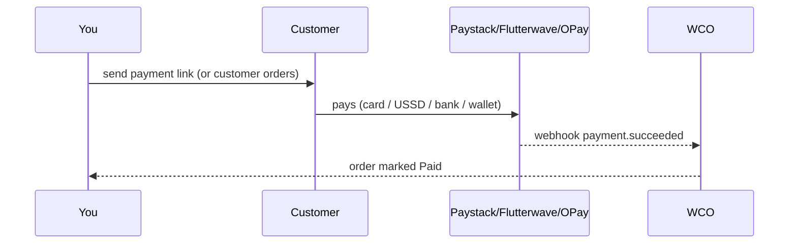

# Payments Guide

Receive money from customers quickly and securely. WCO integrates with **Paystack, Flutterwave, and OPay** so you can get paid in about a minute.

## Setting up payments

**Settings → Payments:**

1. Choose your **payment provider(s)** (Paystack, Flutterwave, OPay).
2. Connect your provider account (log in / API keys).
3. Add a **payout account** (bank account you receive money into).
4. **Save & verify** — WCO confirms the connection.

> Which to choose? Offer the ones your customers use most. In many cases OPay is very common in Nigeria/Kenya; Paystack & Flutterwave cover cards and more.

## How a payment works

- A **payment link** is generated per order.
- When the customer pays, WCO receives a **webhook** and automatically marks the order **Paid**.
- No manual reconciliation.

## Sending a payment link

From an order or a conversation:

1. Open the order → **Send payment link** (or in chat, tap the 💰 button).
2. Share the link with the customer via **WhatsApp** or **SMS**.
3. Wait for the webhook — the order updates to **Paid**.

## Payment methods your customers can use

Depending on the provider and country:
- Card (debit/credit)
- USSD / bank transfer
- Mobile money / wallet (e.g., OPay)
- Bank transfer

## Refunds

- Open a **paid** order → **Refund**.
- Choose full or partial refund.
- WCO processes the refund via the provider and records it.
- Refunded orders are tracked in analytics and the audit trail.

## Payouts

- Money received goes to your connected **payout account** per the provider's schedule (usually next-day or T+1).
- Check balance & payout history under **Settings → Payments → Payouts**.

## Payment statuses

| Status | Meaning | Action |
|---|---|---|
| Pending | Payment link sent, not yet paid | Remind customer / resend link |
| Paid | Payment succeeded | Arrange delivery |
| Failed | Payment declined/failed | Resend link; ask customer to retry |
| Refunded | Money returned to customer | — |

## Troubleshooting

| Issue | Fix |
|---|---|
| Payment not reflecting | Confirm provider connected; check order status; verify webhook |
| Customer says "payment failed" | Resend link; ensure amount correct; try another provider |
| Can't add payout account | Verify bank details with your provider |
| No webhook / order stuck "Paying" | Check Settings → Payments → provider status; contact support |

> **Security:** WCO never stores your full card details; payments are processed by PCI-DSS-compliant providers. See [Security](../security/README.md) and [Compliance](../compliance/README.md).

Need more? → [Troubleshooting](../troubleshooting/README.md)
